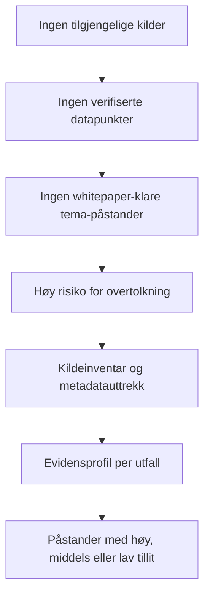

# Evidensnotat for Food Systems 2026

## Sammendrag

Dette evidensnotatet er foreløpig metodisk, ikke empirisk. Arbeidsgrunnlaget i denne tråden inneholder per 20. april 2026 ingen opplastede filer, tekstutdrag eller andre søkbare kilder, og derfor finnes det ennå ingen verifiserbare tematiske funn å destillere.

Det betyr at alle sentrale metadata — kildetype, dato/feltperiode, geografi, studiedesign, utvalgsstørrelse, utfallsdefinisjoner og begrensninger — må behandles som ukjente inntil de faktisk fremgår av materialet. Uten slike opplysninger kan man ikke vurdere direktehet, presisjon, risiko for bias eller overførbarhet på en transparent måte. STROBE løfter nettopp frem setting, relevante datoer, deltakere, datakilder, studiedesign, studiedimensjon, manglende data og statistiske metoder som minimumsinformasjon i observasjonsstudier, mens GRADE-tilnærmingen legger vekt på studiedesign, risiko for systematiske skjevheter, konsistens, direkthet og presisjon når tilliten til dokumentasjonen vurderes. citeturn6view0turn6view1turn5view0turn4view2

Den eneste sterke konklusjonen akkurat nå er derfor at ingen substansielle tema-påstander er klare for whitepaper-bruk. Riktig neste steg er ikke narrativ syntese, men strukturert kildeinventar, metadatauttrekk og evidensprofil per relevant utfall. Dette er også i tråd med hvordan GRADE kobler dokumentasjon til transparente beslutninger og hvordan entity["organization","Folkehelseinstituttet","norwegian public health inst"] beskriver gradering av tillit til dokumentasjon. citeturn5view0turn4view2

## Hva materialet faktisk dokumenterer

**Dokumentert funn:** Det foreligger per nå ikke tilgjengelig analysemateriale i denne tråden.

**Analyse/tolkning:** Uten materiale kan verken funn, metodekvalitet, omfang eller relevans vurderes.

**Arbeidshypotese:** Når materialet foreligger, vil førsteverdien ligge i å klassifisere kildene og trekke ut noen få høyt prioriterte metadata før man forsøker å formulere påstander.

| Punkt | Dokumentert funn | Analyse/tolkning | Arbeidshypotese |
|---|---|---|---|
| Korpus | Ingen filer, notater eller tekstutdrag er tilgjengelige i arbeidsgrunnlaget. | Det finnes ikke et verifiserbart empirisk grunnlag å syntetisere. | Materialet vil trolig bestå av en blanding av primærkilder, sekundære sammendrag og interne notater. |
| Datakilder | Kildetype er ukjent. | Ingen kilde kan rangeres etter autoritet, nærhet til data eller sporbarhet. | En del utsagn vil sannsynlig måtte spores tilbake fra sekundærkilde til primærkilde. |
| Metode | Metode er ukjent. | Det er umulig å vite om funnene er deskriptive, komparative eller kausale. | Mye senere materiale vil sannsynlig vise seg å være observasjonelt eller case-basert, ikke eksperimentelt. |
| Utvalgsstørrelse | Sample size / enhetsnivå er ukjent. | Presisjon, feilmargin og generaliserbarhet kan ikke vurderes. | Små eller ufullstendig rapporterte utvalg vil måtte nedgraderes. |
| Datoer | Dato for datainnsamling, publisering og eventuelt analysevindu er ukjent. | Aktualitet for 2026 kan ikke vurderes. | Eldre funn kan fortsatt ha verdi, men må i så fall merkes som historisk bakgrunn. |
| Geografisk scope | Land, region, kommune, institusjon eller sektor er ukjent. | Overførbarhet og direkte relevans er uavklart. | Kilder med uklar setting vil ha lav ekstern brukbarhet. |
| Begrensninger | Begrensninger er ikke dokumentert. | Høyeste risiko nå er overtolkning. | En rask første-pass-koding vil sannsynlig avdekke store hull i rapporteringen. |

Som minimum bør materialet senere kontrolleres for setting, lokasjoner, relevante datoer, deltakere, datakilder, målemetoder, bias-håndtering, studie­størrelse, manglende data, resultater, begrensninger og generaliserbarhet. Dette er sentrale rapporteringselementer i STROBE, og samme typer opplysninger er nødvendige for å vurdere direkthet, presisjon og samlet tillit etter GRADE. citeturn6view0turn6view1turn5view0

## Hvilke datapunkter som er mest brukbare

**Dokumentert funn:** Ingen faglige datapunkter er tilgjengelige ennå.

**Analyse/tolkning:** Tabellen under rangerer derfor hvilke datapunkter som først bør trekkes ut når materialet mottas.

**Arbeidshypotese:** Disse datapunktene vil gi størst reduksjon i usikkerhet per tidsenhet.

Rekkefølgen under følger det som trengs for å vurdere relevans, pålitelighet og handlingsverdi i lys av STROBE og GRADE: design, setting, deltakere, datakilder, studiedimensjon, bias, direkthet og presisjon. citeturn6view0turn6view1turn5view0

| Rang | Datapunkt å trekke ut først | Status nå | Relevans | Verdi for pålitelighetsvurdering | Handlingsverdi | Kort begrunnelse |
|---|---|---|---|---|---|---|
| 1 | Kildeopphav og kildetype | Ukjent | Svært høy | Svært høy | Svært høy | Skiller primær/offisiell dokumentasjon fra sekundære tolkninger og avgjør hva som kan spores. |
| 2 | Dato og feltperiode | Ukjent | Svært høy | Høy | Svært høy | Avgjør om funnet er aktuelt for 2026 eller kun historisk bakgrunn. |
| 3 | Studiedesign og metode | Ukjent | Svært høy | Svært høy | Svært høy | Nødvendig for å vurdere bias, kausalitet og hvor sterkt en påstand kan formuleres. |
| 4 | Geografisk scope og setting | Ukjent | Svært høy | Høy | Høy | Avgjør overførbarhet til aktuell kontekst. |
| 5 | Utvalgsstørrelse og enhetsnivå | Ukjent | Høy | Svært høy | Høy | Påvirker presisjon, robusthet og generaliserbarhet. |
| 6 | Utfalls- og indikator­definisjoner | Ukjent | Svært høy | Høy | Høy | Uten entydige definisjoner kan datapunkter ikke sammenlignes. |
| 7 | Sammenligningsgrunnlag eller baseline | Ukjent | Høy | Høy | Høy | Nødvendig for å tolke effekt, endring og forskjell. |
| 8 | Begrensninger, manglende data og bias-håndtering | Ukjent | Høy | Svært høy | Middels til høy | Avgjør om en ellers spennende påstand må nedgraderes eller forkastes. |

Praktisk konsekvens: dersom materialet kommer ustrukturert, bør uttrekksskjemaet begynne med de åtte datapunktene over før man gjør noen som helst tematisk konklusjon.

## Hvilke påstander som er sterke nok til whitepaper-bruk

**Dokumentert funn:** For ekstern whitepaper-bruk er listen i praksis tom.

**Analyse/tolkning:** GRADE-logikken forutsetter at tillit og formulering vurderes per utfall. Uten identifiserbare utfall, design, setting og dokumentert kildegrunnlag kan verber som *viser*, *fører til*, *øker*, *reduserer* eller selv *trolig* ikke forsvares. citeturn7view0turn4view2

**Arbeidshypotese:** Når materialet faktisk foreligger, vil noen få smalt avgrensede og klart dokumenterte utsagn trolig kunne løftes til whitepaper-nivå, men bare dersom de kan spores til primær eller offisiell dokumentasjon.

| Påstand | Dokumentert funn | Analyse/tolkning | Arbeidshypotese | Konfidens | Kildetype |
|---|---|---|---|---|---|
| Ingen substansielle tema-påstander bør brukes i whitepaper nå | Ingen verifiserte tema-data foreligger | Whitepaper-formuleringer ville nå være spekulative | Etter kildetriage kan noen få utfallsnære utsagn bli brukbare | Høy | Ingen ekstern kildebase ennå |
| Alle opplysninger om metode, utvalg, geografi, dato og begrensninger må behandles som ukjente | Ingen slike metadata er tilgjengelige | Uten dette kan ikke påstander graderes forsvarlig | Metadata kan delvis gjenfinnes i appendikser, fotnoter eller originale datakilder når materialet mottas | Høy | Ingen ekstern kildebase ennå |
| Eventuelle senere effektpåstander må formuleres etter dokumentert tillit, ikke etter retorisk ønsket styrke | Ingen tillitsvurdering per utfall er mulig ennå | Språket må følge evidensen, ikke omvendt | Noen påstander kan kanskje formuleres som *indikasjoner på* eller *trolig*, men bare etter vurdering | Høy | Bør bygge på primær/offisiell dokumentasjon først, sekundær kun som støtte |

## Hvilke påstander som er interessante men fortsatt for svake

**Dokumentert funn:** Ingen faglige påstander kan testes mot materialet ennå.

**Analyse/tolkning:** De viktigste svake påstandene er derfor ikke tema-spesifikke, men påstandstyper som ofte frister når man har fragmentarisk materiale.

**Arbeidshypotese:** Det meste av fremtidig rydding vil handle om å skille mellom det som faktisk er dokumentert og det som bare er plausibelt.

For at slike påstander senere skal kunne styrkes, må man normalt ha tydelig design, definert utfall, relevant comparator, kjent setting og synlige begrensninger. Dette følger både av STROBE-kravene til metodisk transparens og av GRADEs vektlegging av bias, direkthet og presisjon. citeturn6view0turn6view1turn5view0

| Påstandstype | Dokumentert funn | Analyse/tolkning | Konfidens nå | Hva vil styrke den |
|---|---|---|---|---|
| Effektpåstand | Ingen identifisert intervensjon, comparator eller utfall | Kan ikke vurderes som effekt; bare som utestet mulighet | Lav | Primærstudier eller offisielle data med tydelig design, baseline og resultatmål |
| Trendpåstand | Ingen tidsserier eller relevante datoer | Ingen grunnlag for å si økning, nedgang eller stabilitet | Lav | Minst to sammenlignbare tidspunkter, lik definisjon over tid, dokumentert datakilde |
| Forskjell mellom grupper eller steder | Ingen grupper, strata eller geografier er definert | Risiko for konfunderte og misvisende sammenligninger | Lav | Klare gruppe­definisjoner, justering for sentrale forskjeller, åpen metode |
| Generaliserbarhet | Setting og populasjon er ukjent | Det er umulig å vite om et funn kan overføres bredere | Lav | Tydelig kontekstbeskrivelse, flere case eller uavhengig replikasjon |
| Kostnads- eller skaleringspåstand | Ingen kostnadsmål, ressursmål eller implementeringsdata | Høy spekulasjonsrisiko | Lav | Kostnadsdata, antagelser dokumentert, sensitivitetsanalyse, sammenligningsgrunnlag |

Kort sagt: det mest interessante vil ofte være det minst modent dokumenterte. Inntil materialet faktisk kan etterprøves, bør slike utsagn merkes som arbeidshypoteser, ikke funn.

## Hva dette endrer i vår forståelse av temaet

**Dokumentert funn:** Fraværet av materiale er i seg selv et viktig resultat.

**Analyse/tolkning:** Oppdraget er foreløpig ikke å syntetisere kunnskap om temaet, men å etablere et reviderbart evidensgrunnlag. Før vi vet hva som er målt, hvor, når og hvordan, er det umulig å vite om noe er direkte relevant for Food Systems 2026, eller bare illustrerende bakgrunn. Dette er nettopp kjernen i spørsmål om direkthet, presisjon og generaliserbarhet. citeturn5view0turn6view1

**Arbeidshypotese:** Når korpuset først er strukturert, vil det trolig vise seg at bare en mindre del av materialet tåler ekstern whitepaper-bruk, mens resten best brukes som kontekst, problemforståelse eller hypotesegenerering.

| Punkt | Dokumentert funn | Analyse/tolkning | Arbeidshypotese |
|---|---|---|---|
| Oppdragsforståelse | Ingen tilgjengelige kilder | Arbeidet er i kildeinnsamlingsfase, ikke konklusjonsfase | Når korpuset er komplett, kan man gå fra inventar til syntese |
| Redaksjonell risiko | Ingen sporbar evidensprofil per utfall | Høy risiko for overclaiming hvis man skriver whitepaper nå | Et strengt claims-register vil redusere risiko vesentlig |
| Beslutningsrelevans | Direkte relevans til 2026 kan ikke vurderes | Uten dato og setting kan “relevans” bare antas | De mest brukbare funnene vil trolig være smalt avgrensede, ikke brede |
| Kunnskapsarkitektur | Ingen struktur over kilder | Problemet er fravær av audit trail, ikke fravær av idéer | Et godt uttrekksskjema vil være mer verdifullt enn en tidlig narrativ oppsummering |

Den viktigste innsikten nå er derfor prosessuell: kvaliteten på neste beslutning avhenger mindre av skrivestil og mer av hvor raskt materialet kan gjøres sporbar, sammenlignbar og graderbar.

## Hva bør undersøkes videre

**Dokumentert funn:** Det neste som må undersøkes, er selve materialgrunnlaget.

**Analyse/tolkning:** Undersøkelsen bør følge en fast sekvens: først korpus, så metadata, deretter evidensstyrke, og til slutt whitepaper-formuleringer. Dette samsvarer med en transparent “evidence-to-decision”-logikk. citeturn5view0turn4view2

**Arbeidshypotese:** En kort, disiplinert arbeidsflyt vil sannsynlig produsere langt høyere nytteverdi enn en bred, tidlig syntese.

| Prioritet | Forskningsspørsmål | Foreslått metode | Data som trengs | Indikativ tidslinje |
|---|---|---|---|---|
| Høy | Hvilket korpus finnes faktisk? | Dokumentinventar og versjonskontroll | Filnavn, dato, forfatter, organisasjon, kildetype, språk | 1–2 dager |
| Høy | Hvilke kilder er primære/offisielle, og hvilke er sekundære? | Kildeklassifisering med sporbarhet til original | Lenke til original, mandat, metodevedlegg, datasett eller notegrunnlag | 1–2 dager |
| Høy | Hvilke utfall, indikatorer og definisjoner brukes? | Standardisert uttrekksskjema | Outcome-navn, definisjon, enhet, baseline, comparator | 2–4 dager |
| Høy | Hvor sterke er funnene per utfall? | GRADE-inspirert vurdering og enkel risikokoding | Design, bias, direkthet, konsistens, presisjon, manglende data | 3–5 dager |
| Middels | Hvor relevant er materialet for 2026-konteksten? | Relevansscreening mot dato, setting og geografi | Feltperiode, publikasjonsdato, lokasjon, populasjon | 2–4 dager |
| Middels | Hvilke hull krever supplerende søk? | Gap-analyse og målrettet innhenting | Manglende sample size, ukjent metode, fravær av baselines, uklar geografi | 1–2 dager etter uttrekk |
| Middels | Hvilke påstander kan faktisk tåle ekstern bruk? | Claims-register med konfidensetiketter | Kun sporbare datapunkter med signerte kilder | 1–2 dager etter gradering |

**Anbefalte neste steg**

- **Umiddelbart:** Etabler et komplett dokumentregister med unik ID for hvert dokument, noteutdrag og vedlegg.
- **Umiddelbart:** Merk hver kilde som *primær/offisiell*, *sekundær analyse*, *intern note*, *presentasjon* eller *annet*.
- **Umiddelbart:** Registrer publikasjonsdato, datainnsamlingsperiode og geografisk scope før noen tematisk syntese skrives.
- **Innen 48 timer:** Bygg et standardisert uttrekksskjema for metode, utvalg, utfall, comparator, begrensninger og finansiering.
- **Innen 48 timer:** Skilj konsekvent mellom *dokumentert funn*, *analyse/tolkning* og *arbeidshypotese* i alle arbeidsnotater.
- **Innen 3–5 dager:** Spor alle sterke sekundærpåstander tilbake til original primær- eller offisiell kilde.
- **Innen 3–5 dager:** Lag et claims-register der hver påstand får status: *kan brukes*, *kan kanskje brukes med forbehold*, eller *for svak*.
- **Innen 3–5 dager:** Nedgrader alle funn med ukjent sample size, uklar metode, uklare utfall eller ukjent setting.
- **Innen 1 uke:** Suppler eventuelle hull med primære/offisielle kilder først, og norske kilder der de er relevante og tilgjengelige.
- **Innen 1–2 uker:** Skriv whitepaper kun fra den delen av materialet som overlever sporbarhetskontroll og eksplisitt tillitsvurdering.
- **Løpende:** Hold en egen hypotese-logg separat fra evidensnotatet, slik at interessante ideer ikke forveksles med dokumenterte funn.