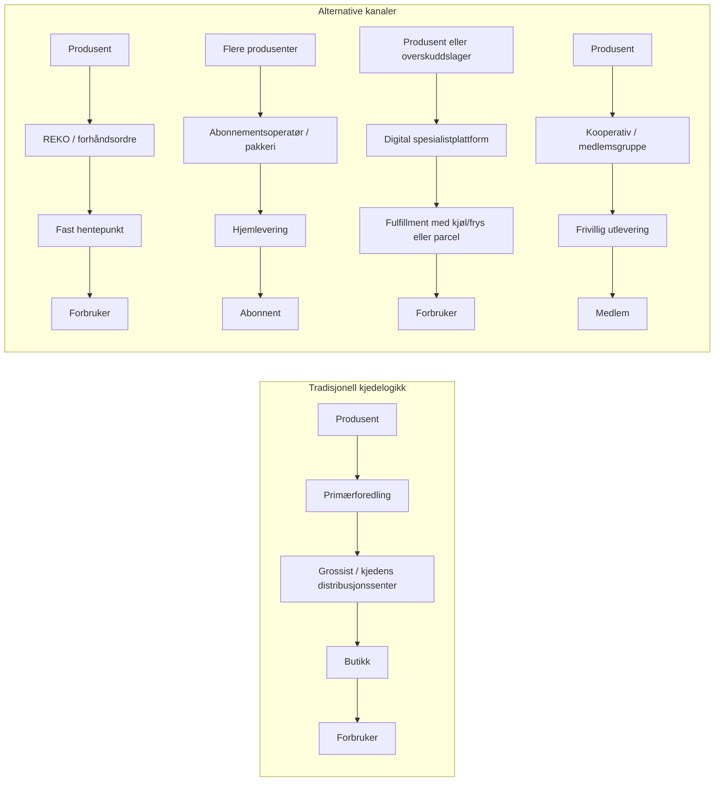

# Alternative distribusjonskanaler som utfordrer og kompletterer dagligvarekjedene i Norden

## Sammendrag for ledelsen

Bildet er ikke at alternative kanaler i Norden erstatter de store dagligvarekjedene, men at de fyller tydelige hull i kjedenes logikk: korte verdikjeder, lokal opprinnelse, fleksibel produktmiks, mindre krav til standardisering og større rom for produsentstyrt prissetting. Særlig i Finland og Sverige er REKO-ringer blitt en skalert “masse-nisje”, mens Norge har bred geografisk dekning men mer ujevn aktivitet. Danmark skiller seg ut ved at REKO foreløpig er tidlig og lokal, ikke nasjonalt etablert. citeturn29search4turn40search11turn39view2turn31search6

Direkte-til-forbruker-salg er den bredest anvendelige modellen på tvers av landene, men den er mest dokumentert i Norge og Finland. I Norge var direkte salg en del av et samlet lokalmat- og drikkesalg på 13,55 milliarder kroner i 2025, hvor direkte salg alene utgjorde 938 millioner kroner i 2024/2025. I Finland viser forskningsmaterialet at direkte salg allerede er en hovedkanal for mange lokalmatbedrifter: over en tredel av respondentene hadde mer enn halvparten av omsetningen sin fra direkte salg, og blant husdyrbruk driver rundt 900 gårder, eller 11 prosent, med direkte salg. citeturn23search0turn23search4turn22view4turn24search0

Abonnementsmodeller er mest modne i Danmark, og deretter i Sverige og Norge. entity["company","Aarstiderne","danish meal-box company"] leverer matkasser til rundt 50 000 husholdninger i Danmark og 10 000 i Sverige, og opplyser samtidig at selskapet ukentlig leverer råvarer til rundt 250 000 måltider i Danmark og Sverige. entity["company","Cheffelo","nordic meal-kit provider"] omsatte for 1 188 MSEK i 2025 og leverte rundt 17 millioner måltider; i 2024 hadde konsernet 505,5 MSEK i Norge, 403,1 MSEK i Sverige og 149,6 MSEK i Danmark. Finland fremstår derimot som mindre modent i offentlig dokumentasjon; Cheffelo planlegger først en pilot i Finland i 2026, mens finske aktører finnes men har svake, lite sammenliknbare offentlige tall. citeturn36view2turn26view0turn36view0turn36view1turn42search1turn42search4

Kooperative modeller har lavest skaleringsgrad i alle fire land, men høy verdi som omstillings- og læringsarena. I Finland viser en regional studie at bare to av sju tradisjonelle matkjøpsgrupper fortsatt var i drift i 2019, og studien konkluderer med at REKO i stor grad har overtatt deres funksjon. I Norge illustrerer entity["organization","Oslo Kooperativ","food cooperative oslo"] både potensialet og begrensningen: medlemmer bestiller annenhver uke, men forplikter seg også til 5–8 timers frivillig arbeid i året. citeturn32search1turn43view0turn43view2

Digitale spesialkanaler er den tydeligste komplementære modellen til tradisjonell dagligvare: de løser ikke “hele handlekurven”, men kan være sterke i spesialsortiment, overskuddsmat, lokalmat eller fryste/fokuserte kategorier. I Norge er entity["company","Dyrket.no","local food e-commerce norway"] et klart eksempel på en lokalmatplattform med kjøl/frys-logistikk og ukentlig levering til over 2 millioner innbyggere på det sentrale Østlandet. I Sverige, Finland og Danmark er entity["company","Matsmart","surplus food e-commerce sweden"] den tydeligste skalerte nisjen, med nordisk omsetning på 756 MSEK i 2024 og posisjon som markedsleder i sitt segment. citeturn42search5turn21view1turn35search1turn21view4

Den viktigste samlede konklusjonen er derfor tredelt. For det første er de mest modne modellene i Norden ikke én modell, men et mønster: REKO i Finland og Sverige, direkte salg i Norge og Finland, og abonnement i Danmark, Sverige og Norge. For det andre er de beste pilotløpene ikke “rene” modeller, men hybrider, særlig REKO pluss samlasting, produsentbokser med fast frekvens, og digitale nisjeplattformer for sesong, andresortering eller lokal spesialmat. For det tredje er kooperative modeller sjelden realistiske som massekanal, men svært realistiske som overgangsmodell for omstillingsgrupper som vil teste etterspørsel, bygge produsentfellesskap og skape lokal legitimitet. citeturn39view0turn22view4turn36view0turn28search0turn43view2

## Datagrunnlag, definisjoner og begrensninger

Denne gjennomgangen bruker fem modellkategorier. REKO-ringer forstås som digitale forhåndsbestillingsnettverk med fast utleveringstid og -sted. Direkte-til-forbruker omfatter gårdsutsalg, veiboder, selvplukk, Bondens marked-lignende kanaler, direktelevering og direkte salg til husholdninger. Abonnement omfatter matkasser, grøntkasser og andre repeterende bokser. Kooperative modeller omfatter matkjøpsgrupper, andelslandbruk/CSA og medlemsdrevne innkjøpsordninger. Digitale spesialkanaler omfatter spesialiserte nettkanaler som lokalmatplattformer, overskuddsmat-nettbutikker og andre smale e-handelsplattformer utenfor fullsortimentsdagligvare. citeturn39view2turn22view4turn43view2turn21view1turn21view4

Kildesituasjonen er ujevn. De sterkeste, mest sammenliknbare tallene finnes for norske lokalmatvolumer, børsnoterte eller rapporterende abonnementsaktører og enkelte finske undersøkelser om kanalbruk. For REKO, matkjøpsgrupper og små kooperativer er nasjonale statistikker svake eller fraværende; forskningen bruker ofte Facebook-medlemskap, surveys eller regionale case. Det betyr at “utbredelse” ofte må estimeres via proxies som antall grupper, medlemmer, omsatte måltider eller respondenters kanalbruk. citeturn23search0turn23search4turn36view0turn36view1turn22view4turn39view0

Det er også viktige målefeil i REKO-data. Norsk forskning påpeker at medlemskap i Facebook-grupper ikke tilsvarer unike kunder, fordi mange er med i flere ringer. Svenske og finske forskere peker i tillegg på at gruppene kan ha mange passive medlemmer, og at det er vanskelig å fastslå hvor stor andel som faktisk kjøper. Dette er avgjørende når medlems- eller gruppetall brukes som penetrasjonsmål. citeturn30search1turn40search12turn43view0

Det mest robuste mikroøkonomiske materialet i denne rapporten kommer fra tre undersøkelser: en norsk REKO-survey med litt over 200 produsenter og litt under 1 800 forbrukere, en finsk lokalmatundersøkelse med 335 svar av 2 221 inviterte virksomheter, og en NIBIO-intervjustudie i Troms og Finnmark med 11 produsenter og fire representanter for salgskanaler. Resultatene er nyttige, men bør ikke leses som full nasjonal telling. citeturn39view0turn22view4turn22view3

Fordi ingen av landene publiserer en direkte sammenliknbar, oppdatert markedsandel for REKO, gårdsutsalg, matkasser, kooperativer og digitale spesialkanaler samlet, bruker figuren under en **indikativ penetrasjonsindeks** fra 0 til 5. Indeksen er en analytisk syntese basert på dokumentert utbredelse, målbar vekst, antall grupper/plattformer, offentlig synlighet og organisatorisk modenhet. Den er nyttig som modenhetsmål, men er **ikke** et mål på eksakt omsetningsandel. citeturn29search4turn40search11turn23search4turn22view4turn36view1turn36view2

```text
Indikativ penetrasjonsindeks for alternative matkanaler (0–5)

Sverige  ████████░░  3,8
Norge    ███████░░░  3,6
Finland  ███████░░░  3,4
Danmark  ██████░░░░  3,0
```

## Markedsbildet i Norge, Sverige, Danmark og Finland

På tvers av de fire landene peker materialet på fire tydelige mønstre. Finland er sterkest på REKO og direkte salg. Sverige er sterkest på REKO kombinert med skalerte digitale nisjer og abonnement. Norge er sterkest på direkte salg og lokalmat som økonomisk kategori, med REKO som bred kanal og digital lokalmat som meningsfull komplement. Danmark er sterkest på abonnement og svakest på REKO, mens alternative lokale økosystemer særlig er dokumentert i og rundt København. citeturn29search4turn40search11turn23search0turn23search4turn36view2turn28search0

Tradisjonell dagligvarelogikk er samtidig tung i hele regionen, særlig i Norge og Finland. entity["organization","Konkurransetilsynet","norway competition authority"] beskriver det norske dagligvaremarkedet som konsentrert, med høye etableringshindringer og svak konkurranse. I Finland opplyser det finske arbeids- og næringsdepartementet at en aktør med over 30 prosent markedsandel anses dominerende i dagligvaredetalj, og OECD oppgir at S Group, Kesko og Lidl hadde markedsandeler på henholdsvis 48, 34 og 10 prosent i 2023. Alternative kanaler må derfor forstås som kanaler som i hovedsak utfordrer **måten** verdiskaping og distribusjon organiseres på, mer enn å velte kjedemarkedet i volum. citeturn20search1turn20search3turn19search3turn19search11

### Sammenlikning av modeller på tvers av land

| Modell | Norge | Sverige | Danmark | Finland | Analytisk vurdering | Dokumentasjon |
|---|---|---|---|---|---|---|
| REKO-ringer | Over 130 ringer i dag; 80 ringer ved utgangen av 2019 og anslagsvis 400 000 Facebook-medlemmer den gangen, men ikke unike kunder. | Omtrent 220 aktive REKO-ringer og rundt 800 000 Facebook-medlemmer i januar 2021. | Pilot-/oppstartsfasen; dokumentert Køge-pilot i 2019 og Aarhus fra november 2024, men ingen bred nasjonal utrulling funnet. | Over 200 grupper og rundt 280 000 medlemmer i 2019; opphavslandet for modellen. | Moden nisje i Finland og Sverige, funksjonell men ujevn i Norge, tidlig pilot i Danmark. | Se kilder: citeturn39view2turn30search1turn40search11turn31search2turn31search6turn29search4 |
| Direkte-til-forbruker | Målt og voksende: direkte salg utgjorde 938 mill. kroner i 2024/2025 innen lokalmat og -drikke; Bondens marked omsatte for 76,4 mill. kroner i 2024. | Fragmentert og dårlig nasjonalt målt, men litteraturen peker på økende direktekjøp og sterke korte kjeder for lokale produkter. | Fragmentert, særlig dokumentert som urbane/regionalt forankrede økosystemer; minst 100 kartlagte alternative aktører i København/Greater Copenhagen. | Meget sentral kanal: over en tredel av lokalmatbedriftene hadde over halvparten av omsetningen fra direkte salg; ca. 900 husdyrbruk, eller 11 %, driver direkte salg. | Mest realistiske masse-nisje i Norge og Finland; mulig, men svakere dokumentert, i Sverige og Danmark. | Se kilder: citeturn23search4turn23search2turn22view4turn24search0turn28search0turn42search0turn33search10 |
| Abonnement | Etablert: Cheffelo hadde 505,5 MSEK i Norge i 2024 og sterk vekst i 2025. | Etablert: Linas Matkasse 403,1 MSEK i 2024; Aarstiderne leverer til ca. 10 000 svenske husholdninger. | Mest modent: Aarstiderne leverer til ca. 50 000 danske husholdninger; RetNemt hadde 149,6 MSEK i 2024. | Tidlig/fragmentert i offentlig dokumentasjon; Cheffelo først med Finland-pilot i 2026. Ruokaboksi fremstår viktig, men tilgjengelige tall er uensartede og delvis markedsføringsdrevne. | Mest moden i Danmark; tydelig moden i Sverige og Norge; foreløpig svakere institusjonalisert i Finland. | Se kilder: citeturn36view0turn36view1turn36view2turn26view0turn42search1turn42search4 |
| Kooperative modeller | Tydelig nisje; eksemplifisert av medlemsbaserte ordninger som Oslo Kooperativ og andelslandbruk. | Nasjonalt nettverk og håndbok finnes, men ingen robust nasjonal telling funnet i gjennomgåtte kilder. | Finnes som madfællesskaber og lokale fellesskap, men dokumentasjonen er by- og prosjektpreget. | Tradisjonelle matkjøpsgrupper er svake; i én regional studie var bare to av sju fortsatt aktive i 2019. | Viktige som lærings- og tillitsarenaer, men sjelden realistisk som stor volumkanal. | Se kilder: citeturn43view2turn21view2turn28search0turn43view0 |
| Digitale spesialkanaler | Voksende komplement: Dyrket leverer ukentlig til over 2 millioner på Østlandet; flere portaler forsøker å samle lokalmat. | Sterk komplementær kanal: Matsmart, Linas/meal-kit og spesialaktører inngår i svensk nettmat-økologi. | Sterk komplementær kanal rundt abonnement og urbane matsystemaktører; Aarstiderne og Matsmart er tydelige. | Mer fragmentert: REKO og direkte gårdssalg er viktigere enn én klar nasjonal spesialistvinner i det offentlige kildematerialet. | Skalerbar komplementær kanal i alle land, spesielt der kategorien er smal og logistikkvennlig. | Se kilder: citeturn42search5turn21view1turn35search1turn21view4turn36view2turn22view4 |

### Nøkkelaktører og hva de forteller om markedet

I Norge er de viktigste observerbare aktørene entity["organization","REKO Norge","local food network norway"], entity["company","Dyrket.no","local food e-commerce norway"], entity["organization","Bondens marked","norway farmers market"] og Cheffelos norske merkevarer. Tilsammen peker de på et marked der direkte relasjoner, lokal identitet og distribusjon i avgrensede geografier er betydelig mer modne enn i mange land utenfor Norden. Offisielle lokalmattall fra entity["organization","Stiftelsen Norsk Mat","local food foundation norway"] viser samtidig at volumet er stort nok til å være økonomisk relevant, men fortsatt lite nok til at kanalene må regnes som komplementære til dagligvare. citeturn39view2turn42search5turn23search2turn23search0turn23search4

I Sverige er REKO-ringer og abonnementsmodeller de tydeligste alternativene, mens digitale spesialkanaler som Matsmart har direkte skala. Svensk dagligvarestatistikk viser dessuten at hotell- og spesialaktører som nettbutikkene Delitea, Linas Matkasse, MatHem, Matkomfort og Matsmart inngår i statistisk samarbeid om utviklingen i netthandel, noe som illustrerer at svenske alternative nettkonsepter er mer integrert i markedsbildet enn bare som småprosjekter. Samtidig understreker svensk REKO-forskning at modellen ikke trenger å erstatte mainstream-forsyningen for å være viktig; den virker nettopp som et korrektiv, en læringsarena og en lokal markedsplass. citeturn27search11turn35search1turn40search11turn37search20

I Danmark er abonnementslogikken tydeligst, med Aarstiderne som referansepunkt. entity["organization","Madland","copenhagen food systems initiative"] viser samtidig at alternative kanaler i København og omegn er mangfoldige, men at økosystemet framstår mer som et nettverk av mindre aktører enn én samlet nasjonal alternativ infrastruktur. Det danske REKO-sporet er, basert på tilgjengelige kilder, fortsatt på forsøks- og lokalt pilotnivå. citeturn36view2turn26view0turn28search0turn42search0turn31search6

I Finland er REKO og direkte salg tydeligst dokumentert, og dette skiller Finland fra Danmark. Samtidig tyder kildene på at tradisjonelle matkjøpsgrupper har tapt terreng, og at digitale nisjer oftere legger seg oppå eksisterende direktekanaler enn skaper helt nye organiseringsformer. Det gjør Finland til landet der “kort kjede + digital koordinering” er mest moden, men ikke nødvendigvis landet med den mest industrialiserte alternative netthandelen. citeturn29search4turn24search0turn22view4turn43view0

## Produktfit, produsentøkonomi og lokal verdiskaping

Hvilke produkter som passer hvilke kanaler, er mer avgjørende enn land alene. De alternative kanalene belønner ikke volum i seg selv; de belønner ofte fortelling, fleksibilitet, sesongmessighet, differensiering og evnen til å fylle en bestemt logistikknisje. Finland-studien på lokalmat viser samtidig at produsentene ikke oppfatter alle alternative kanaler som like lønnsomme: direkte salg fra egen gård eller egen butikk ble vurdert som mest lønnsomt og mest attraktivt, mens egen nettbutikk kom svakest ut. citeturn22view4

### Produkt- og produsentfit

| Modell | Produktkategorier som passer best | Produsenttyper som passer best | Hvorfor produktfitten er god | Empirisk grunnlag |
|---|---|---|---|---|
| REKO-ringer | Egg, ferske grønnsaker, bær, honning, kjøttstykker, bakervarer, småskala foredlede varer | Små og mellomstore produsenter i kjørbar radius, særlig øko-/spesialprodusenter | Kanalen håndterer sesong, små batcher, ujevn tilgjengelighet og “ikke-supermarkedstandard”, og gir direkte prissetting mot kunde | Grunnlag: citeturn39view0turn41view5turn41view6 |
| Direkte-til-forbruker | Potet, rotgrønnsaker, grøntkasser, selvplukk, egg, meieri, gårdsforedlet kjøtt, bær | Bynære gårder, gårder med besøksstrøm, blandede bruk og små foredlere | Lavt mellomleddspåslag, høy tillit, god match med sesongvarer og produkter der opprinnelse betyr mye | Grunnlag: citeturn22view4turn22view3turn41view0turn41view4 |
| Abonnement | Standardiserte matkasser, grøntkasser, gjentakende fiske-/kjøttbokser, pantry- og oppskriftsbaserte løsninger | Produsenter som kan levere jevnt, samt aggregatorer/pakkerier | Krever frekvens, forutsigbarhet og pakking, men gir bedre planhorisont og kundelojalitet | Grunnlag: citeturn36view0turn36view1turn36view2 |
| Kooperative modeller | Sesonggrønnsaker, brød, egg, lokale basisvarer, økologiske varer | Agroøkologiske gårder, CSA-gårder og produsenter som kan jobbe tett med medlemmer | Høy sosial verdi, men fungerer best der medlemmene aksepterer medvirkning, mindre bekvemmelighet og sesongpreget sortiment | Grunnlag: citeturn43view2turn43view0turn44search2 |
| Digitale spesialkanaler | Overskudds- og datovarer, hylle- og frysevarer, spesialost, spesialkjøtt, fisk, lokalmat med lang holdbarhet | Nisjebrands, overskuddslogistikkaktører, produsentfellesskap, regionale markedsplasser | God når kategorien er smal, historien er sterk eller logistikk kan sentraliseres uten å ødelegge ferskhetsløftet | Grunnlag: citeturn21view1turn42search5turn35search1turn21view4 |

REKO-ringer er særlig gode for kategorier der supermarkedets standardisering virker mot produsenten. Den finske REKO-studien viser at 62 prosent av produsentene mente REKO forbedret lønnsomheten, 53 prosent rapporterte at lønnsomheten faktisk hadde økt, og 23 prosent oppga høyere salgspriser etter at de ble med. Studien viser også at REKO ga bedre markedsadgang, sterkere forhandlingsmakt og større rom til å prissette arbeid og kvalitet selv. Spesielt for små økologiske eggprodusenter og grønnsaksprodusenter kunne REKO gi tilgang til et marked som de ikke fikk lønnsomt gjennom grossist eller dagligvare. citeturn41view5turn41view6

REKO spiller også en tydelig lokalverdiskapende rolle. I den norske Telemarksforsking-studien var den viktigste forbrukermotivasjonen å støtte lokalt næringsliv og bidra til lokal verdiskaping. Blant produsentene var tilgang til større marked og REKO som viktig markedskanal særlig tydelig for bær og økologiske grønnsaker. Svensk forskning fra pandemiperioden peker samtidig på at REKO-baserte samarbeidsformer økte robustheten hos de minste håndverksmatbedriftene ved å styrke kunnskapsdeling, nettverk og markedsrekkevidde. citeturn39view0turn38view1

Direkte salg er bredere og mer robust enn REKO når produsenten enten er bynær, har eget utsalgssted, kan bruke selvplukk eller har et produkt som tåler enkel lokal logistikk. Den finske lokalmatstudien fant likevel ikke noe entydig generelt prispremie for direkte salg sammenlignet med andre kanaler, nettopp fordi sammenlikningene ofte ikke fanger tidsbruk, pakking, transport og andre produsentkostnader. Direkte salg kan derfor gi høyere brutto margin, men ikke nødvendigvis høyere netto margin uten nok tetthet og gjenkjøp. citeturn22view4

Den norske NIBIO-studien fra Troms og Finnmark illustrerer dette tydelig. Intervjuene viser god etterspørsel og markedsadgang, og ett kanalrepresentant-sitat oppsummerte situasjonen med at “lokalproduserte grønnsaker selger seg selv”. Samtidig beskrives lønnsomheten som krevende, og produsentene peker på lange avstander, små markeder, manglende infrastruktur og tidspress som de sentrale hindringene. Behovet for samarbeid går derfor igjen: lokalmatbil, fast torgplass, samvirke/innkjøpsordning og investeringer i pakking og lagring framstår som like viktige som selve produktet. citeturn22view3turn41view0turn41view2turn41view3turn41view4

Abonnement gir en annen type økonomi. Her er fordelen ikke nødvendigvis høyest stykkpris, men bedre planbarhet, lavere etterspørselsstøy og større kundelojalitet. Både Cheffelo og Aarstiderne dokumenterer at denne modellen kan skaleres langt utover lokalmatmiljøet. Samtidig betyr abonnementsmodeller ofte at en mellomaktør tar over pakking, oppskriftsdesign, kundedata og sisteleddlogistikk. For produsenten er det derfor sjelden en ren høymarginmodell; det er oftere en modell for bedre avsetningssikkerhet og volumplanlegging. citeturn36view0turn36view1turn36view2turn26view0

Digitale spesialkanaler passer best der sortimentet er smalt eller historien er sterk. Dyrket beskriver selv en modell der varer samles i én handlekurv og hentes hos produsentene etter ordre, med kjøle- og fryselevering til kundens dør. Matsmart viser den motsatte logikken: ikke lokal opprinnelse, men spesialisering i overskudd og datonær varestrøm, med høyere bruttofortjeneste fordi plattformen løser et lagerproblem for leverandørene. Analytisk betyr det at “digital spesialkanal” ikke er én ting; det er minst to forskjellige økonomier – kuratert lokalmat og redistribuert overskuddsmat – som begge kan være bærekraftige komplement til dagligvaren. citeturn21view1turn42search5turn42search9turn35search1turn21view4

## Logistikk, regelverk og skalering

Kanalvalget er i praksis et valg av logistikkregime. Dagligvarekjedene optimerer rundt sentraliserte innkjøp, standardiserte spesifikasjoner og høy fylingsgrad i distribusjonen. Alternative kanaler flytter i stedet kompleksitet mot koordinering, kundekontakt, plattformarbeid og eller lokal samlasting. Særlig for ferskvarer er spørsmålet ikke bare “kan produktet selges direkte?”, men “hvem bærer kostnaden ved kjølekjede, plukk, ruting, medlemsarbeid eller hentepunkt?” citeturn20search1turn19search11turn21view1turn43view2turn22view3

Både REKO, kooperativ og abonnementsmodeller er i realiteten ulike svar på samme logistikkproblem. REKO reduserer sisteleddskostnaden ved å la kunden komme til hentepunktet. Kooperativ reduserer kostnaden ytterligere ved å løfte noe arbeid over på medlemmene. Abonnement og digitale spesialkanaler gjør det motsatte: de øker bekvemmeligheten for kunden, men må dermed bygge tettere ruter, bedre pakkeprosesser og mer profesjonell kundeservice. Det er nettopp derfor abonnement er mest modent i Danmark, der tett befolkning og kortere avstander gjør hjemlevering lettere å skalere enn i Norge og Finland. citeturn36view2turn36view0turn21view1turn43view2turn22view3



Flytdiagrammet over er en syntese av hvordan REKO-ringer, abonnement, kooperativer og digitale spesialkanaler faktisk organiserer distribusjonen i de gjennomgåtte kildene: forhåndsbestilling og hentepunkt i REKO, annenhver-uke- eller ukebaserte medlemsleveringer i kooperativ, og sentral pakking + hjemlevering i abonnementsløsninger og digitale spesialkanaler. citeturn39view2turn36view2turn21view1turn43view2

### Regulatorisk sammenlikning

| Land | Mattrygghet og registrering | Merking og fjernsalg | Transport og temperatur | Skatt/mva | Hva dette betyr operativt | Kilder |
|---|---|---|---|---|---|---|
| Norge | entity["organization","Mattilsynet","norway food safety authority"] krever at de fleste som produserer og selger mat registrerer virksomheten. | Ved nettsalg må obligatorisk informasjon for ferdigpakkede varer være tilgjengelig før kjøp; sporbarhet og korrekt merking gjelder også i korte kjeder. | Kjølevarer skal normalt holdes riktig nedkjølt; offentlig veiledning bruker 0–4 °C som hovedregel for kjølevarer. | entity["organization","Skatteetaten","norway tax administration"] oppgir 15 % mva på næringsmidler og 25 % som alminnelig sats. | Lav etableringsterskel sammenlignet med kjedegrossist, men ikke “uregulert”: produsenten må mestre registrering, temperaturkontroll, sporbarhet og matmerking. | Se kilder: citeturn15search2turn15search0turn15search5turn45search0turn45search4 |
| Sverige | entity["organization","Livsmedelsverket","sweden food agency"] og kommunal kontroll krever registrering av livsmedelsvirksomhet, også for gårdsbutikk og internettsalg. | Ved distansförsäljning skal obligatorisk informasjon normalt gis før kjøpet. | Transport skal beskytte maten og holde korrekt temperatur; kjølekjede er lastbærende. | entity["organization","Skatteverket","sweden tax agency"] opplyser at matmoms er 6 % fra 1. april 2026, mens restaurangtjenester fortsatt har annen sats. | Sverige er regelmessig enklest for digitale direktekanaler fordi reglene er tydelig kommunisert, men kravene til informasjon og sporbarhet er reelle. | Se kilder: citeturn16search1turn16search0turn16search12turn45search3turn45search11 |
| Danmark | entity["organization","Fødevarestyrelsen","denmark food authority"] krever som hovedregel registrering av netbutik/virksomhet; enkelte små, hjemlige aktiviteter vurderes mot bagatellgrænser. | Ved fjernsalg skal lovpliktig informasjon normalt være tilgjengelig før kjøp. | Direkte levering til sluttkunde kan ha noe mer praktisk fleksibilitet enn B2B-grossistlogistikk, men maten skal fortsatt beskyttes og holdes trygg. | Dansk moms er som utgangspunkt 25 %. | Danmark har relativt fleksibel operativ virkelighet for små aktører, men høy standardmoms og hovedstadsdominert marked kan gjøre marginer krevende. | Se kilder: citeturn14search0turn14search1turn14search4turn14search9turn45search1 |
| Finland | entity["organization","Ruokavirasto","finland food authority"] har detaljerte regler om elintarvikehuoneisto/registrering, direkte salg og visse unntak for primærproduksjon. | Ved etäsalg må obligatorisk informasjon i hovedsak være tilgjengelig før kjøp. | Veiledning angir blant annet maks +6 °C for nedkjølte matvarer til forbruker og minst +60 °C for varme matvarer. | entity["organization","Vero","finnish tax administration"] oppgir 13,5 % moms på elintarvikkeita fra 2026. | Finland har et relativt modent regelverk for korte kjeder, men temperaturkrav og geografi gjør sisteleddlogistikk dyr for ferskvarer. | Se kilder: citeturn17search1turn17search0turn17search11turn45search2turn45search14 |

Regelverksmessig er det viktigste skillet ikke mellom “tradisjonell” og “alternativ” kanal, men mellom **selve salgsregimet** og **produktets risiko**. Nakne grønnsaker, honning og hyllevarer er vesentlig enklere å selge direkte enn kjølekrevende animalske produkter eller sammensatte ferdigretter. Samtidig betyr fjernsalg at selv små produsenter må håndtere pre-kontraktuell informasjon og sporbarhet på et nivå som ligner profesjonell netthandel. Det gjør at mange små produsenter faktisk får bedre økonomi i REKO eller hentepunktsmodeller enn i full hjemlevering. citeturn17search0turn16search0turn15search0turn14search4turn22view4

Operativt er den største nordiske barrieremiksen derfor: små og sesongmessige volum, lang eller kostbar transport, kjølekjedekrav, administrativ belastning omkring merking og informasjon, samt fravær av samlasteinfrastruktur. NIBIOs nordnorske case gjør dette tydelig: der pekes det på lange avstander, små markeder, manglende infrastruktur og svak lønnsomhet som de sentrale hindringene, selv når etterspørselen i seg selv er god. citeturn41view0turn41view2turn41view3

## SWOT per modell

Tabellen under er en syntese. Poengene er analytisk bearbeidet fra forskningen og de offisielle/industrielle kildene i siste kolonne.

| Modell | Styrker | Svakheter | Muligheter | Trusler | Kildegrunnlag |
|---|---|---|---|---|---|
| REKO-ringer | Lav oppstartskostnad, høy transparens, sterk lokal legitimitet, god for prisautonomi og markedsadgang | Avhenger av ildsjeler, aktive administratorer og stabile hentepunkt; Facebook-medlemmer overdriver ofte faktisk aktivitet | Kan kobles til samlasting, kommunale hentepunkt, institusjonsmarked og produsentsamarbeid | Fallende kjøpekraft, frivilligutmattelse, varierende lokal kvalitet, svak koordinering mellom ringer | Grunnlag: citeturn39view0turn39view2turn41view5turn41view6turn43view0 |
| Direkte-til-forbruker | Høyest potensial for lokal verdiskaping, sterk relasjon til kunde, god historiefortelling | Tid- og logistikkintensivt, skalerer dårlig uten samlasting, netto lønnsomhet kan bli svak | Kan utvides med abonnement, selvplukk, restaurantlevering og andresortering | Lav tetthet, vær/sesongvariasjon, høye transportkostnader og begrenset kapasitet hos produsenten | Grunnlag: citeturn23search4turn22view4turn22view3turn41view3turn41view4 |
| Abonnement | Forutsigbar etterspørsel, bedre planhorisont, høy kundelojalitet, effektiv pakking ved nok volum | Krever sterk operatør, pakkeri, data/CRM og rutenett; produsent får ikke nødvendigvis høyest margin | Kan bli bro mellom små produsenter og større husholdningsmarked; godt egnet for B2B/B2E-piloter | Kundetretthet, høye anskaffelseskostnader, prissensitivitet og konkurranse fra bekvemmelighetsdagligvare | Grunnlag: citeturn36view0turn36view1turn36view2turn26view0 |
| Kooperative modeller | Bygger tillit, læring og forbrukerforankring; gir rom for sosial innovasjon og medvirkning | Krever frivillig arbeid, tåler dårlig passiv medlemsmasse og skalerer sjelden operativt | Sterk arena for omstilling, matkunnskap og test av nye avlings- og delingsmodeller | Lav stabilitet over tid, særlig når tilgjengeligheten i vanlige butikker øker og medlemmene blir mer bekvemmelighetsorienterte | Grunnlag: citeturn43view2turn43view0turn21view2 |
| Digitale spesialkanaler | Skalerbar nisje, fokusert sortiment, sterk datafangst, gode muligheter for kuratering og overskuddslogikk | Krever profesjonell IT, kundeservice, fulfillment og ofte investorkapital | Kan håndtere lokalmat, datasortering, hyllevarer, frysevarer og overskudd uten å konkurrere direkte med fullsortimentsbutikken | Høye CAC- og logistikkostnader, svak lønnsomhet uten volum, risiko for å miste lokal identitet ved skalering | Grunnlag: citeturn21view1turn42search5turn35search1turn21view4 |

## Konklusjoner og pilotideer

### Mot tradisjonell kjedelogikk

Tradisjonell kjedelogikk i Norden er bygget for standardisering, sentraliserte innkjøp, høy leveringspresisjon, kategoristyring og skalafordeler. I Norge og Finland skjer dette i markeder som også er tydelig konsentrerte. Alternative kanaler opererer med en helt annen logikk: de aksepterer mer variabel tilgjengelighet, mindre batcher, høyere informasjonsinnhold per vare og mer aktiv involvering fra kunden. Der kjedene premierer leveringssikkerhet, standard varelinjer og forhandlingsmakt, premierer alternative kanaler opprinnelse, fleksibilitet, tillit og lokal historiefortelling. citeturn20search1turn20search3turn19search11turn41view5turn41view6

Dette betyr ikke at alternative kanaler automatisk gir høyere lønnsomhet. Tvert imot viser både den finske lokalmatstudien og NIBIOs nordnorske case at mye av marginforbedringen spises opp av tid, kjøring, pakking og koordinering hvis ikke kanaldesignet er godt nok. Den reelle fordelen ligger derfor ikke bare i å kutte mellomledd, men i å kutte **feil** mellomledd og samtidig bygge riktig lokal logistikk. Derfor er hybridmodeller ofte bedre enn rene idealmodeller. citeturn22view4turn22view3turn41view3

### Mest modne modeller

Den mest modne modellen i Danmark er abonnement, først og fremst representert ved Aarstiderne og, i et annet segment, RetNemt. I Sverige er den mest modne porteføljen kombinasjonen av REKO, abonnement og digital spesialhandel. I Finland er REKO og direkte salg mest modne. I Norge er direkte salg og REKO de mest realistiske brede alternativene, mens digitale lokalmatplattformer er de mest interessante komplementene for urbane markeder. Kooperative modeller er i alle land modne som **sosial praksis**, men ikke som stor distribusjonskanal. citeturn36view2turn36view1turn40search11turn29search4turn23search4turn39view2turn43view0

Ser man på modenhet på tvers av Norden, peker tre modeller seg ut. Den første er REKO-lignende bestillings- og hentepunktmodeller, men bare der det finnes nok produsenter og nok kundetetthet. Den andre er abonnementsmodeller med profesjonell pakking og ruteøkonomi. Den tredje er digitale spesialkanaler med smalt vareløfte, særlig lokalmat i avgrensede områder og overskuddsmat i bredere geografier. D2C er svært realistisk, men ofte best som paraply over flere underformer, ikke som én kanal. citeturn39view0turn36view0turn35search1turn21view1

### Pilotideer for omstillingsgrupper

Det mest lovende pilotsporet for omstillings- eller overgangsgrupper er en **REKO-pluss-modell**: digital forhåndsbestilling, fast hentepunkt, og en enkel samlastingsfunksjon drevet av én koordinator eller et lite produsentfellesskap. Pilotens styrke er at den kan starte billig, den kan måle reell etterspørsel raskt, og den kan brukes til å teste hvilke kategorier som faktisk gir netto margin når transport og arbeid regnes inn. Den passer særlig for egg, grønnsaker, bær, honning og utvalgte kjøttprodukter. citeturn39view0turn41view5turn41view6turn22view3

Et annet realistisk spor er en **abonnementsbasert regionskasse** som samler 5–15 produsenter rundt et begrenset, repeterbart løfte, for eksempel “sesongkasse + proteinvalg” eller “arbeidsplasskasse annenhver uke”. Dette bygger på den dokumenterte modenheten i danske, svenske og norske abonnementsmodeller, men kan skaleres ned til en region eller en overgangsgruppe. Kritisk designvalg er å standardisere frekvens, ikke nødvendigvis hele innholdet, og å bruke et lite pakkeri eller en delt produksjonshub. citeturn36view2turn36view1turn36view0

Et tredje spor er en **kooperativ test- og læringspilot**. Denne bør ikke designes som fremtidig hovedkanal, men som en overgangsstruktur for å bygge forbrukerlojalitet, frivillige og forståelse for sesong og produksjonsrisiko. Her er målsettingen ikke høyest volum, men høyest læring per krone. Den kan fungere godt i bynære områder med ressurssterke medlemmer, særlig dersom man knytter den til ett eller to andelslandbruk/CSA-gårder og lar digital bestilling redusere koordinasjonskostnaden. citeturn43view2turn43view0turn44search4turn44search2

Et fjerde, svært konkret spor er en **digital nisjepilot for andresortering og overskudd**. Her kan omstillingsgrupper koble produsenter, lokal foredling og husholdninger gjennom en enkel nettbutikk eller partnerplattform som selger “kort sesong, kort dato, skjeve grønnsaker, restpartier eller frysevarer”. Denne piloten bygger på logikken i Matsmart og, i en lokalmatvariant, Dyrket. Den er særlig interessant fordi den kan forbedre ressursutnyttelsen uten å kreve at hele gården eller produsentnettverket skifter kanal. citeturn35search1turn21view4turn21view1turn42search5

På tvers av alle pilotene er det ett grep som går igjen som mest avgjørende: bygg **distribusjonsfellesskap**, ikke bare salgskanal. Forskningen fra Finland og Norge, og case-materialet fra Sverige, peker i samme retning: alternative kanaler blir økonomisk og sosialt sterke når produsenter samarbeider om synlighet, henting, kunnskapsdeling og enkel infrastruktur. Når de står alene, forblir kanalene ofte sårbare nisjer. Når de samordnes, kan de bli realistiske overgangsveier ut av ren kjedelogikk. citeturn41view6turn41view2turn38view1