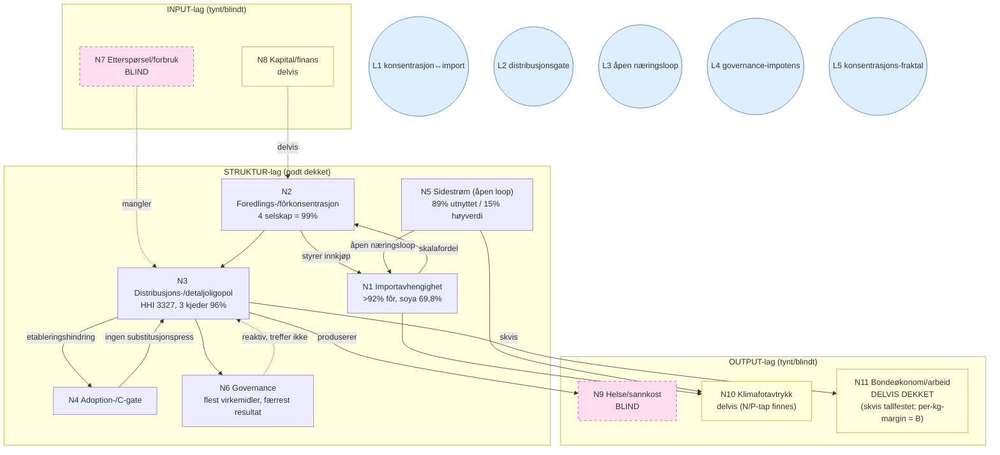

# Integrert systemmodell — det norske/nordiske matsystemet

## 1. Hva dette er, og hvorfor

R2–R5 har produsert en utmerket *delekatalog*: import, konsentrasjon, distribusjon, sirkularitet, governance — hver godt dokumentert. Men en delekatalog er ikke en modell. En god analytiker trenger den monterte motoren: hva driver hva, hvor er tilbakekoblingene, hvilke noder er strukturbærende, og — avgjørende — *hvor mangler modellen input*.

Modellen har tre lag: **INPUT** (det som driver systemet) → **STRUKTUR** (det vi har kartlagt grundig) → **OUTPUT** (det systemet produserer). Mesteparten av arbeidet vårt ligger i strukturlaget. Blindsonene ligger systematisk i input- og output-lagene — derfor «ser» vi maktstrukturen skarpt, men ikke kreftene som driver den eller konsekvensene den skaper.

## 2. Nodene (forankret i dokumenterte funn)

**Strukturlaget (godt dekket):**

- **N1 Importavhengighet** — >92 % av laksefôr importert; Brasil-soya 69,8 % (SSB 08801); ~95 % av husdyr-proteinfraksjon importert (Lbdir); fosfat ~100 % importert; Mauritania-fiskeolje ~7,5–10 % (DRO-R5-A5, A1, A3, B-klyngen).
- **N2 Foredlings-/fôrkonsentrasjon** — fire fôrselskap = 99 % (Menon 2019); TINE/Nortura toppene i samvirke (FORST-R4-17, DRO-R5-A2).
- **N3 Distribusjons-/detaljoligopol** — HHI 3327, tre kjeder 96 %; ASKO-distribusjonsgate; BAMA; EMV-vekst (SE 24,6 % / FI 25 %); eiendomsmodell/lease-back som etableringshindring (DRO-R5-C1/C4, casestatus distribusjon/eiendom).
- **N4 Adoption-/C-gate** — nye/sirkulære/lokale produsenter når ikke marked fordi 3 kjeder + integrert grossist styrer tilgangen (DRO-R4-15, FORST-R4-21).
- **N5 Sidestrøm/sirkularitet (åpen loop)** — restråstoff 89 % «utnyttet» men 15 % høyverdi; oppdrettsslam ~2 % samlet; digestat-næringsretur måles kun i SE; struvitt kun HIAS, volum upublisert (DRO-R5-B1–B4).
- **N6 Governance** — flest virkemidler, færrest strukturelle resultat; stat eier matsikkerhet, fylkeskommune-hull; beredskapslager under oppbygging (DRO-R5-D1/D3, batch-07).

**Inputlaget (tynt/blindt):**

- **N7 Etterspørsel/forbruk** — *blind*: kostholdsendring, proteinskifte, adferd, kultur.
- **N8 Kapital/finans** — *delvis*: vi har eierskap + lease-back, ikke investeringsstrømmer/subsidiearkitektur (kun OECD PSE 59 % nevnt).

**Outputlaget (tynt/blindt):**

- **N9 Helse/sannkost** — *blind*: kostholdsrelatert sykdom, eksternaliserte kostnader.
- **N10 Klimafotavtrykk** — *delvis*: Scope 3/ILUC i kantene (A1/A3); ingen systematisk fotavtrykks-ryggrad. N/P-tap til fjord finnes (66 000 t N / 14 000 t P, DRO-R5-B2).
- **N11 Bondeøkonomi/arbeid** — *delvis dekket (DRO-R6-N11, 2026-06-18)*: kostnads-pris-skvisen er nå tallfestet (BFJ prisindeks kostnader 5–7 pp over inntekter 2017–2023; laveste ammeku 33 % av sammenligningslønn og sauebruk 38–74 %; 2022–23-gjødselsjokk +127 %, realfall 75 200 kr/årsverk 2023). Gjenstår B: per-kg-margin etter kjøperprisavtale (aktørdata).

## 3. De fem låsesløyfene (motoren)

Her sitter den egentlige analysen — *hvorfor* systemet er stabilt tross at alle ser problemet:

**L1 — Konsentrasjon ↔ import (samme struktur, to ansikter).** De konsentrerte fôr-/foredlingsleddene styrer *både* markedsmakt og import-innkjøpet (FORST-R4-17). Billig soya er rasjonelt for den som har makt → import vedvarer → skalafordel → mer konsentrasjon. Markedsmakt og importsårbarhet er ikke to problemer, men én struktur. *Implikasjon:* de som kan endre importavhengigheten har minst insentiv til det.

**L2 — Distribusjonsgaten (incumbent-lås).** Detaljoligopol + integrert grossist + lease-back → etableringshindring (N4) → nye sirkulære/lokale/alt-protein-produsenter skalerer ikke → ingen substitusjonspress på incumbents → strukturen består (DRO-R4-15, FORST-R4-21). Selvforsterkende.

**L3 — Den åpne næringssløyfen.** Sidestrømmer er «utnyttet» (talt) men mest til lavverdi (fôr/energi), og næringsretur måles/lukkes ikke → systemet importerer jomfruelig fosfat mens det ikke gjenvinner egne næringsstoffer → forsterker N1 (FORST-R4-19, DRO-R5-B3/B4). «Utnyttelses»-metrikken *maskerer* den åpne loopen.

**L4 — Governance-impotensen.** Flest virkemidler, færrest resultat (batch-07). Reaktiv håndheving (bøter) endrer ikke struktur; ingen forebyggende strukturell terskel (vs. FI 30 %-regel). Konsentrasjon → politisk/lobby-makt → reform forblir reaktiv → konsentrasjon består. *Dette er den minst utforskede sløyfen — agency/politikk, ikke bare struktur.*

**L5 — Konsentrasjons-fraktalen.** Nasjonal konsentrasjon (HHI 3327) og lokale distriktsmonopol (median postnummer-HHI = monopol; Coop 48,8 % i 50 minst folkerike kommuner) er samme fenomen på to skalaer (FORST-R4-20). Samme motor, ulik oppløsning.

## 4. Kausalkart

Les pilene som *analytiske hypoteser* (syntese), ikke målt kausalitet. De stiplede pilene fra N7/N8 og til N9/N11 er der modellen mangler input/output — blindsonene.

> **Oppdatering 2026-06-29 (N11):** N11 er flyttet fra BLIND til **DELVIS DEKKET**. Kostnads-/prisskvisen på primærleddet er nå tallfestet og primærkilde-forankret (DRO-R6-N11, BFJ/NIBIO Totalkalkylen UT-1-2026 + Statens tilbud 2026), og verifisert ved uavhengig aritmetikk- og URL-kontroll 2026-06-29. **Gjenstår** før formell lukking: per-kg-margin etter kjøperprisavtale (Type B / aktørdata) og grønn `audit:citable`/`gate:overclaim` i miljø med DB. Analyseprosaen i §5–7 under er skrevet før denne oppdateringen og omtaler N11 som blindsone i sin opprinnelige ramme.

## 5. Blindsonene plassert på modellen

Poenget med å montere motoren er at blindsonene ikke er tilfeldige — de klynger seg systematisk:

| Blindsone | Hvor i modellen | Hva vi ikke kan svare uten den |
|---|---|---|
| **Etterspørsel/forbruk (N7)** | Manglende INPUT | Hva driver endring? Transisjonens *kraft*, ikke bare dens *låser*. For et «transition group»-prosjekt er dette det mest påfallende tomrommet. |
| **Helse/sannkost (N9)** | Manglende OUTPUT | Hva *koster* systemet utover markedsprisen? Linsen som mest endrer en ekstern lesers oppfatning. |
| **Klimafotavtrykk (N10)** | Delvis OUTPUT | Systemets miljøregnskap som helhet — i dag fragmentert (Scope 3/ILUC i kantene). |
| **Bondeøkonomi (N11)** | Manglende STRUKTUR-halvdel | Den som *presses* i konsentrasjonshistorien. Vi har den som presser (N2/N3), ikke skvisen på primærleddet. |

To meta-mangler binder dem:

- **Ingen eksplisitt objektivfunksjon.** «Bra» matsystem — bra *for hva*? Resiliens, helse, utslipp, bondelivsgrunnlag, selvforsyning? Modellen bærer i dag flere mål implisitt uten å rangere dem. Analysen ser fundamentalt forskjellig ut avhengig av svaret (se §6).
- **Kausalpilene er hypoteser, ikke testet.** Denne modellen *er* første forsøk på den monterte motoren; neste steg er å teste de fem sløyfene mot data der det er mulig (L1 og L5 er allerede delvis evidens-forankret; L4 er minst utforsket).

## 6. Hva objektivfunksjonen gjør med analysen

Samme modell, ulike mål → ulike strukturbærende noder:

- **Mål = resiliens/beredskap:** N1 (import) + N6 (beredskap) blir kritiske; L1 er hovedsløyfen.
- **Mål = klima:** N1 + N10 + drøvtygger-/metan (udekket); L3 (åpen næringsloop) blir sentral.
- **Mål = folkehelse:** N7 + N9 (begge blinde i dag) blir kritiske — vi har nesten ingenting.
- **Mål = bondelivsgrunnlag/distrikt:** N11 (blind) + L2 + L5 blir motoren.
- **Mål = sirkularitet:** N5 + L3, der vi faktisk står sterkt.

Dette er den skarpeste innsikten av å montere modellen: *prosjektet står sterkest analytisk for sirkularitets- og resiliensmålene, og svakest for helse- og bondeøkonomi-målene* — og hvis et av de to siste er en reell ambisjon, er det der neste innsats bør gå, ikke i mer av det vi allerede dekker godt.

## 7. Neste analytiske trekk (i prioritert rekkefølge)

1. **Velg objektivfunksjon eksplisitt** (eller ranger 2–3). Alt annet kalibreres mot den.
2. **Test L4 (governance-impotens)** — den minst utforskede og mest forklaringskraftige sløyfen: hvorfor skjer ikke reform tross full diagnose? (agency/politikk/diskurs, ikke struktur.)
3. **Lukk den blindsonen objektivfunksjonen krever** — ikke alle fire. Hvis helse: N7+N9 (true-cost-linsen). Hvis distrikt: N11 (bondeøkonomi).
4. **Behandle de fem sløyfene som hypoteser å falsifisere**, ikke etablerte sannheter — det er forskjellen på en delekatalog og en analyse.

---

*Denne modellen er en analyse over eksisterende materiale, ikke et datasøk. Den åpner ingen claims; den viser hvor de monterte delene allerede bærer, og hvor motoren mangler drivstoff. Den bør oppdateres når en blindsone fylles eller en sløyfe testes mot data.*
