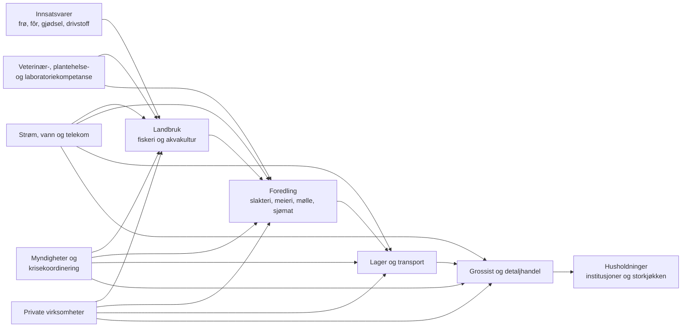

# Kompetanse og beredskap i de nordiske matsystemene

## Sammendrag

De fem nordiske landene har høy institusjonell kapasitet, sterke mattrygghetsmyndigheter og relativt robuste kommersielle verdikjeder, men de har **svært ulike modeller for forsyningsberedskap for mat**. Finland skiller seg klart ut med den mest institusjonaliserte, lovforankrede og kontinuerlig operative modellen: forsyningssikkerhet er organisert gjennom National Emergency Supply Agency/Huoltovarmuuskeskus (NESA/HVK), strategiske lagre og lovfestede sektorer og «pools» der næringslivet inngår direkte i beredskapsorganiseringen. Den finske loven gir dessuten myndigheten adgang til informasjon om blant annet produksjonskapasitet, lokaler og personell hos kritiske virksomheter. citeturn4search1turn4search5

Sverige er i den raskeste oppbyggingsfasen. Etter flere tiår med nedbygging av deler av totalforsvars- og lagerberedskapen er matforsyning og drikkevann nå en egen beredskapssektor under Livsmedelsverket. Fra 1. juli 2026 har Sverige også et nytt lovgrunnlag for beredskapslagre av varer gjennom hele matkjeden. Loven er uttrykkelig innrettet mot krig, krigsfare og ekstraordinære mangelsituasjoner, og åpner for lagring ikke bare av ferdig mat, men av innsatsvarer som er nødvendige for produksjon og ferdigstilling. citeturn14search3turn14search2turn14search5

Norge har betydelig fagkompetanse og sterke sektormyndigheter, men styringsmodellen er mer fragmentert. Næringsberedskapsloven gir omfattende hjemler for offentlig–privat samarbeid og tiltak som prioritering, omfordeling og i ytterste fall rasjonering, mens ansvaret for matområdet er fordelt mellom Nærings- og fiskeridepartementet, Landbruks- og matdepartementet og Helse- og omsorgsdepartementet, med Mattilsynet som sentral kjedemyndighet. Riksrevisjonen konkluderte i 2023 med at Norge ikke var godt nok forberedt på alvorlige hendelser som kunne ramme matsikkerheten. Siden er kornberedskapen bygget opp igjen; målet er 82 500 tonn matkorn innen 2029, omtrent tre måneders forbruk. citeturn13search0turn8search2turn7search1turn0search1turn7search0

Danmark har en **sektoransvarsmodell** snarere enn en finsk type samlet forsyningssikkerhetsorganisasjon. Beredskapslovgivningen legger planansvar på den enkelte sektor, mens det nye systemet etter EUs CER-direktiv gjør produksjon, bearbeiding og distribusjon av mat til en eksplisitt del av kritisk-infrastrukturarbeidet; Fødevarestyrelsen er kompetent myndighet for kritiske enheter i matsektoren. Styrelsen for Samfundssikkerhed (SAMSIK) har samtidig fått en sentral rolle i samfunnssikkerhet, nasjonal krisestyring, forsyningssikkerhet, cyberberedskap og beredskapsopplæring. citeturn15search4turn16search1

Island har meget sterk praktisk kompetanse på naturfare, evakuering og hendelseshåndtering, men den offentlig tilgjengelige arkitekturen for **langsiktig matforsyningsberedskap** er mindre utviklet og mindre transparent enn i Finland og Sverige. Den nasjonale matpolitikken mot 2040 setter både *fæðuöryggi* — tilgang på mat — og mattrygghet på dagsordenen, mens Matvælastofnun (MAST) har operative opplegg for alvorlige dyresykdommer, naturkatastrofer og matbårne utbrudd. Samtidig er Island strukturelt avhengig av import av matvarer, råstoff og kritiske innsatsfaktorer som drivstoff og gjødsel. citeturn19search1turn18search2turn18search1

På tvers av Norden er **den viktigste kompetanseutfordringen ikke mangel på generell fagkunnskap**, men utilstrekkelig dokumentert *surge capacity*: Hvor mange mennesker med riktige sertifikater, myndighet, lokal kunnskap og praktisk trening kan faktisk mobiliseres dersom strøm, telekommunikasjon, betalingstjenester, drivstoff, transport eller grenseflyt svikter samtidig? Offentlige kilder gir påfallende lite sammenlignbar informasjon om denne beredskapsarbeidsstyrken. Finland er et unntak på enkelte områder; den finske matmyndigheten oppgir omkring 80 særskilt beredskapstrente veterinærer, hovedsakelig kommunale embetsveterinærer. citeturn4search4

Det andre hovedfunnet er at matsystemberedskap i økende grad må forstås som **kompetanse i et system av avhengigheter**, ikke som nasjonal selvforsyningsgrad alene. Korn, fisk, melk eller kjøtt er lite tilgjengelig uten energi, vann, fôr, gjødsel, reservedeler, emballasje, veterinærmedisiner, laboratorier, kjøle-/frysekjede, IT, betalingsløsninger, havner, lastebiler og kvalifisert arbeidskraft. Sveriges nye lagerlov illustrerer denne dreiningen ved eksplisitt å åpne for lager av varer på flere trinn i verdikjeden; høringsinnspillene identifiserte blant annet veterinærdiagnostikk, fôr, innsatsvarer og reservedeler til spesialkjøretøy som kritiske avhengigheter. citeturn14search2

Den tredje hovedkonklusjonen er at **privat sektor er selve produksjons- og distribusjonsberedskapen**. Offentlig beredskap kan regulere, prioritere, betale, koordinere og holde strategiske reserver, men mesteparten av lager, foredling, transport og detaljhandel ligger hos bedrifter. Finland har integrert dette forholdet mest eksplisitt i institusjonene; Norge bruker blant annet Rådet for matvareberedskap og kontrakter med private kornlageraktører; Sverige bygger nå en kombinasjon av statlig eierskap og kontraktsbasert lagerhold. citeturn4search1turn8search12turn7search0turn14search2

Nordisk samarbeid er samtidig i ferd med å gå fra generell erfaringsutveksling til et mer sikkerhetspolitisk prosjekt. Karlstad-erklæringen fra 2024 løfter beredskap og robusthet i matforsyning og skogbruk, og de nordiske landbruksministrene fortsatte arbeidet i 2025. På EU-nivå er European Food Security Crisis Preparedness and Response Mechanism (EFSCM) etablert som en arena for situasjonsforståelse og krisekoordinering, og EU-kommisjonen har siden arbeidet med stresstesting av matforsyningen. NATO behandler robuste mat- og vannressurser som ett av sine grunnleggende krav til nasjonal motstandsdyktighet. citeturn21search0turn4search3turn21search1turn21search10turn21search9

**Samlet vurdering:** Finland har den høyeste institusjonelle modenheten; Sverige har den kraftigste pågående kapasitetsoppbyggingen; Norge har høy sektorkompetanse, men et dokumentert koordinerings- og planleggingsgap; Danmark har sterke operative og regulatoriske kapasiteter, men en mer desentralisert og mindre offentlig synlig matforsyningsarkitektur; og Island har svært sterk generell krisehåndtering, men større strukturell import- og kompetansesårbarhet som følge av størrelse og geografi. Dette er en analytisk sammenstilling av strukturene over, ikke en offisiell rangering. citeturn4search1turn14search5turn0search1turn16search1turn19search1

## Analytisk rammeverk og datagrunnlag

I denne rapporten brukes **matforsyningssikkerhet** om evnen til å sikre fysisk og økonomisk tilgang på tilstrekkelig mat gjennom kriser, mens **mattrygghet** brukes om trygg mat uten uakseptabel biologisk, kjemisk eller fysisk risiko. Skillet er viktig fordi de nordiske matmyndighetene historisk har hatt svært høy kompetanse på mattrygghet, dyrehelse og offentlig kontroll, mens nasjonal forsyningssikkerhet etter den kalde krigen i flere land fikk mindre organisatorisk oppmerksomhet. Sveriges omfattende gjenoppbygging og Norges gjeninnføring av matkornlager illustrerer dette skillet. citeturn1search3turn7search0

Analysen vurderer beredskap langs hele kjeden: innsatsvarer → primærproduksjon og fiskeri/akvakultur → foredling → lager og transport → grossist/detaljhandel → offentlige kjøkken og husholdninger. I tillegg vurderes fem tverrgående funksjoner: energi og vann, digital infrastruktur, laboratorie-/veterinærkapasitet, beslutnings- og juridisk kompetanse og evnen til å mobilisere personell.

Denne systemtilnærmingen er nødvendig fordi beredskapslagring av kalorier alene ikke løser sårbarheter i foredling eller distribusjon. Den svenske lovprosessen i 2026 er særlig illustrerende: høringsinstansene pekte på behov for blant annet dyrehelsemateriell, laboratoriediagnostikk, innsatsvarer til husdyrproduksjon og reservedeler til jordbrukets spesialkjøretøy. citeturn14search2

Datagrunnlaget er i hovedsak lover, proposisjoner, nasjonale utredninger og myndighetsinformasjon fra 2023–2026, supplert med nordiske og europeiske samarbeidsdokumenter. Det er en viktig begrensning at operative beredskapsplaner ofte helt eller delvis er sikkerhetsgradert eller ikke offentliggjort. Manglende offentlig dokumentasjon kan derfor **ikke tolkes som fravær av beredskap**.

En annen alvorlig databegrensning gjelder personell. Det finnes ingen harmonisert nordisk statistikk for «arbeidsstyrken i matberedskapen». Ordinær sysselsettingsstatistikk for jordbruk, fiske, næringsmiddelindustri, transport og handel sier lite om hvem som faktisk kan utføre kritiske oppgaver under krise. Derfor er usammenlignbare nasjonale sysselsettingstall ikke slått sammen til et kunstig «beredskapsårsverk»-mål. Der eksplisitte kapasitetsdata finnes — som Finlands om lag 80 beredskapsveterinærer — er de oppgitt separat. citeturn4search4

## Landprofiler

**Norge**

| Tema | Profil |
|---|---|
| **Nøkkelmyndigheter** | Nærings- og fiskeridepartementet har sentrale oppgaver innen nærings- og matvareberedskap, Landbruks- og matdepartementet for jordbruksproduksjon og Helse- og omsorgsdepartementet for helserelaterte deler; Mattilsynet er sentral myndighet gjennom matkjeden. NIBIO, Veterinærinstituttet, Havforskningsinstituttet og Folkehelseinstituttet leverer kunnskapsstøtte. citeturn7search1turn8search4 |
| **Juridisk rammeverk og planer** | Næringsberedskapsloven er hovedverktøyet for samarbeid mellom myndigheter og næringsliv ved forsyningskriser og gir grunnlag for prioritering og særskilte tiltak. Totalberedskapsmeldingen styrker det brede sivile beredskapsarbeidet. Sektorplanlegging suppleres av dyrehelseplaner og nå gjenoppbygget matkornlager. citeturn13search0turn8search2turn0search0turn7search2 |
| **Koordinering** | Rådet for matvareberedskap er den formelle offentlige–private arenaen på matvareforsyningsområdet. Private bedrifter brukes også direkte gjennom beredskapsavtaler, eksempelvis ved lagring av matkorn. citeturn8search12turn7search0 |
| **Utdanning og forskning** | NMBU er sentral for landbruk, matvitenskap og veterinærutdanning; NIBIO dekker agronomi, jord, planter og landbruksøkonomi; Veterinærinstituttet dyrehelse/zoonoser; Havforskningsinstituttet marine ressurser; Nofima mat- og prosessforskning. Offentlig kunnskapsstøtte til Mattilsynets ansvarsområde er også eksplisitt beskrevet i statsbudsjettet. citeturn7search1 |
| **Næringsliv** | Landbruksorganisasjoner, dagligvare-, grossist-, mølle-, sjømat- og foredlingsbedrifter er operative kapasitetsbærere. Kornberedskapen bygges blant annet gjennom avtaler med Norgesmøllene, Fiskå Mølle og Strand Unikorn. Bondelaget har i 2026 kritisert at primærprodusentene ikke er tilstrekkelig representert i Rådet for matvareberedskap. citeturn7search0turn8search14 |
| **Frivillighet** | Frivillig sektor er mindre integrert i den kommersielle matkjeden enn næringslivet, men staten opprettet i 2026 en egen ordning på fire millioner kroner for frivillig beredskapskapasitet blant annet innen mat- og måltidsberedskap. citeturn7search3 |
| **Viktige hendelser siste 15 år** | Tørken i 2018, COVID-19, de globale råvare- og innsatsvaresjokkene etter Russlands fullskala invasjon av Ukraina i 2022 og økt risiko for høypatogen fugleinfluensa har alle synliggjort avhengigheter knyttet til fôr, import, arbeidskraft, transport og dyrehelse. Riksrevisjonens gjennomgang i 2023 konkluderte bredt med utilstrekkelig beredskap. citeturn0search1turn7search2 |
| **Fem viktigste kompetansegap — analytisk vurdering** | **Kjedeanalyse** av kritiske innsatsvarer; **kriselogistikk og distribusjon** ved strøm-/tele-/transportbortfall; **surge-kapasitet innen veterinær-, plantehelse- og laboratoriefag**; **beredskapskompetanse i primærproduksjonen og bedre produsentmedvirkning**; **cyber-/OT- og kontinuitetskompetanse** i foredling, grossist og detaljhandel. Vurderingen bygger særlig på Riksrevisjonens kritikk, sektorfragmenteringen og den pågående lageroppbyggingen. citeturn0search1turn8search14turn7search0 |

Norges styrke er et stort fagmiljø rundt landbruk, veterinærmedisin, sjømat og mattrygghet samt etablerte relasjoner mellom staten og næringslivet. Svakheten er at **fagkompetanse ikke automatisk blir systemberedskap**. Riksrevisjonens kritikk og gjeninnføringen av kornlager viser at myndighetene selv har vurdert tidligere kapasitet som utilstrekkelig. Målet om 82 500 tonn matkorn i 2029 er et viktig materielt tiltak, men lagerets verdi avhenger av at møller, strøm, transport, emballasje og distribusjon fungerer. citeturn0search1turn7search0

**Sverige**

| Tema | Profil |
|---|---|
| **Nøkkelmyndigheter** | Livsmedelsverket er sektorsansvarlig myndighet for beredskapssektoren «livsmedelsförsörjning och dricksvatten»; Jordbruksverket dekker primærproduksjon og viktige dyre-/plantehelsefunksjoner. Myndigheten för civilt försvar, tidligere MSB, har fra 1. januar 2026 den sentrale tverrsektorielle rollen i sivilt forsvar. citeturn14search3turn14search0 |
| **Juridisk rammeverk og planer** | Totalforsvarsreformen 2025–2030, myndighetenes beredskapsstruktur og Livsmedelsverkets sektorplanlegging danner grunnlaget. Utredningen *Livsmedelsberedskap för en ny tid* foreslo sterkere nasjonal regulering. Riksdagen vedtok i 2026 lov om beredskapslager i matkjeden, med ikrafttredelse 1. juli 2026. citeturn1search3turn14search4turn14search5 |
| **Koordinering** | En tydelig sektoransvarsmodell kombinerer Livsmedelsverket, Jordbruksverket, regionale länsstyrelser, kommuner og private aktører. Statskontoret har samtidig påvist behov for sterkere styring og mer ensartet kommunal og regional kapasitet. citeturn14search1 |
| **Utdanning og forskning** | Sveriges lantbruksuniversitet (SLU), Statens veterinärmedicinska anstalt (SVA) og RISE utgjør et sterkt kunnskapsmiljø; SLU driver også eksplisitt forskning om bærekraftig matberedskap. Livsmedelsverket utvikler håndbøker og metodekompetanse, blant annet for offentlige måltider. citeturn10search13turn1search12 |
| **Næringsliv** | Lantbrukarnas Riksförbund, Lantmännen, dagligvareaktører, fôr-/kornbransjen og matindustrien er sentrale. Høringen om lagerloven viser at næringsliv og fagmiljøer nå trekkes inn i utformingen av både vare- og innsatsvareberedskap. citeturn14search2 |
| **Frivillighet** | Frivillige forsvars- og beredskapsorganisasjoner kan støtte logistikk, informasjon og lokal utholdenhet, men hovedtyngden av den formelle matberedskapen ligger hos myndigheter, kommuner og kommersielle kjedeaktører. |
| **Viktige hendelser siste 15 år** | Tørken i 2018, COVID-19, krigen i Ukraina og det første svenske utbruddet av afrikansk svinepest i 2023 har vært viktige stressprøver. Det nye totalforsvaret og lagerpolitikken må forstås som respons på både slike erfaringer og et fundamentalt endret sikkerhetspolitisk bilde. citeturn1search3turn14search4turn1search13 |
| **Fem viktigste kompetansegap — analytisk vurdering** | **Kommunal og regional variasjon i beredskapskompetanse**; **kompetanse på fysisk lagerstyring og rotasjon** etter flere tiår uten omfattende system; **kritiske innsatsvarer og produksjonsomstilling**; **offentlige måltider under langvarige avbrudd**; **veterinær/laboratorie-, cyber- og logistikk-surgekapasitet**. citeturn14search1turn14search2turn1search28 |

Sverige fremstår i 2026 som det nordiske landet med størst **endringstakt**. Lagerloven representerer et vesentlig skifte fra beredskap som hovedsakelig planlegging til beredskap med fysisk materiell kapasitet. At loven tillater lagring i flere ledd er faglig viktig: den reduserer risikoen for at et lager med korn eksisterer samtidig som fôr, laboratoriereagenser, emballasje eller nødvendige reservedeler mangler. citeturn14search2

Samtidig har Statskontoret pekt på ulikheter i lokal kapasitet. Det er en sentral kompetanseutfordring fordi mye av den faktiske matberedskapen under en krise ligger i kommunenes institusjonskjøkken, vannforsyning og omsorgstjenester, ikke bare hos nasjonale myndigheter. citeturn14search1turn1search12

**Danmark**

| Tema | Profil |
|---|---|
| **Nøkkelmyndigheter** | Fødevarestyrelsen regulerer og kontrollerer kjeden fra jord til bord og håndterer dyrehelse og mattrygghet; Styrelsen for Samfundssikkerhed (SAMSIK) arbeider med blant annet forsyningssikkerhet, nasjonal krisestyring, beredskapsplanlegging og cyber-/informasjonssikkerhet. citeturn16search0turn16search1 |
| **Juridisk rammeverk og planer** | Beredskabsloven bygger på sektoransvar: ministerområdene skal planlegge for videreføring av samfunnsviktige funksjoner. CER-lovgivningen fra 2025 styrker kravene til kritiske enheters motstandsdyktighet. Matsektoren — produksjon, bearbeiding og distribusjon — er eksplisitt omfattet, og Fødevarestyrelsen er kompetent myndighet. citeturn15search4turn16search1 |
| **Koordinering** | Danmark benytter en desentralisert sektoransvarsmodell supplert med SAMSIKs tverrsektorielle krisestyring og National Operativ Stab. Den offentlige dokumentasjonen viser mindre av en egenstående nasjonal matforsyningsorganisasjon enn Finland og Sverige. citeturn16search1 |
| **Utdanning og forskning** | Københavns Universitet har sentrale miljøer innen veterinærmedisin, mat og ressursøkonomi; DTU Fødevareinstituttet innen mattrygghet, mikrobiologi og risikovurdering; Aarhus Universitet innen jordbruksforskning; SEGES Innovation kobler forskning, rådgivning og landbrukspraksis. SAMSIK tilbyr egne kurs i krisestyring og beredskapsplanlegging. citeturn11search0 |
| **Næringsliv** | Landbrug & Fødevarer, SEGES Innovation og store meieri-, kjøtt-, ingrediens-, logistikk- og dagligvareaktører har betydelig operativ kompetanse. CER-regimet gjør kontinuitets- og robusthetskompetanse hos matbedriftene enda mer direkte relevant. citeturn16search1 |
| **Frivillighet** | SAMSIK har i 2026 igjen åpnet en tilskuddsordning for sivilsamfunnsorganisasjoner som skal styrke befolkningens beredskapskunnskap. Frivillighetens rolle er imidlertid i hovedsak komplementær til bedriftenes og myndighetenes matforsyningsoppgaver. citeturn16search1 |
| **Viktige hendelser siste 15 år** | Tørken 2018 og COVID-19 er sentrale, men minkkrisen i 2020 er den mest lærerike hendelsen for institusjonell kompetanse. Minkkommisjonen konstaterte alvorlige problemer knyttet til rettslig hjemmel, informasjonsflyt og beslutningsprosesser ved beslutningen om å avlive all mink. citeturn22search0turn22search2 |
| **Fem viktigste kompetansegap — analytisk vurdering** | **Juridisk beredskapskompetanse under tidspress**; **tverrdepartemental One Health-ledelse**; **systematisk matforsynings-/innsatsvareanalyse utover mattrygghet**; **cyber-/OT-beredskap i høyt automatisert foredling og logistikk**; **øving av langvarig nasjonal forsyningssvikt**, ikke bare avgrensede hendelser. citeturn22search2turn16search1 |

Minkkrisen er særlig viktig i en kompetanserapport fordi den viser at beredskap ikke bare er veterinærfag. Kommisjonens gjennomgang viser hvordan **juridisk kvalitetssikring, eskalering av usikkerhet, dokumentasjon og klar rolleforståelse** kan bli like kritiske som epidemiologisk kompetanse. Kommisjonen fant blant annet at spørsmålet om hjemmel ikke ble tilstrekkelig løftet før den vidtrekkende beslutningen ble kommunisert, til tross for at relevante deler av forvaltningen hadde identifisert problemet. citeturn22search0turn22search2

Den nye CER-arkitekturen er derfor vesentlig også for matberedskap: den flytter oppmerksomheten fra «kan myndigheten håndtere hendelsen?» til «kan den kritiske virksomheten fortsette å levere tjenesten?». citeturn16search1

**Finland**

| Tema | Profil |
|---|---|
| **Nøkkelmyndigheter** | Huoltovarmuuskeskus/National Emergency Supply Agency er kjernen i forsyningssikkerhetssystemet; Finnish Food Authority/Ruokavirasto håndterer mattrygghet, dyre-/plantehelse og kontroll; departementene og regionale/lokale myndigheter inngår i modellen. citeturn4search1turn4search2 |
| **Juridisk rammeverk og planer** | Act on Securing Security of Supply 1390/1992 etablerer det nasjonale systemet, fondet, rådet og sektor-/poolstrukturen. Emergency Powers Act 1552/2011 gir ekstraordinære virkemidler for blant annet produksjon og distribusjon og definerer primærproduksjon bredt, inklusive fiske og akvakultur. citeturn4search1turn4search5 |
| **Koordinering** | Den mest formaliserte offentlig–private modellen i Norden. Loven etablerer sektorer og pools for å organisere samarbeidet; minst halvparten av Security of Supply Council skal representere næringslivet. NESA kan innhente informasjon om blant annet virksomheters produksjon, personell og lokaler. citeturn4search1 |
| **Planverk** | Mat-/fôrkontrollens flerårige nasjonale plan krever myndighetsvise beredskapsplaner og forutsetter at ordinære ansvarslinjer videreføres i krise, med omprioritering og tettere samarbeid. Egen primærproduksjonsberedskap er utviklet for alvorlige forstyrrelser. citeturn4search2turn4search6 |
| **Kompetanse og utdanning** | Universitetet i Helsingfors er sentralt innen veterinærmedisin, landbruk og matvitenskap; Natural Resources Institute Finland/Luke innen jordbruk, bioøkonomi og ressursanalyse. NESA-systemets næringslivspools fungerer samtidig som en kontinuerlig øvings- og læringsarena. |
| **Spesifikk personellkapasitet** | Finnish Food Authority oppgir om lag **80 beredskapsveterinærer**, hovedsakelig kommunale embetsveterinærer, med særskilt trening; ordningen suppleres med statlig veterinærvakt. citeturn4search4 |
| **Næringsliv og frivillighet** | Næringslivet er innebygd i den formelle forsyningssikkerhetsstrukturen, ikke bare konsultert ad hoc. Den frivillige sektoren støtter den bredere samfunnsberedskapen, men bedrifter og bransjeorganisasjoner er den primære ikke-statlige kapasiteten i matsystemet. citeturn4search1 |
| **Viktige hendelser siste 15 år** | Tørken 2018, COVID-19, virkninger av Russlands angrep på Ukraina på energi, gjødsel og handel og senere fugleinfluensarisiko har stresset systemet. Den finske modellen har først og fremst vist verdien av etablerte relasjoner og planverk før krisen oppstår. citeturn4search2turn4search4 |
| **Fem viktigste kompetansegap — analytisk vurdering** | **Forståelse av nye utenlandske innsatsavhengigheter**; **cybersikkerhet og OT i produksjon/logistikk**; **erstatningskompetanse for svært spesialiserte nøkkelpersoner**; **klimatilpasning av nordlig planteproduksjon**; **One Health-surgekapasitet ved samtidige dyre-/folkehelsehendelser**, selv om Finland ligger relativt sterkt på sistnevnte. citeturn4search1turn4search4 |

Finlands modell reduserer et problem som er tydelig i andre land: at myndighetene først må finne ut **hvem i privat sektor som har relevant kapasitet etter at krisen har startet**. Lovgrunnlaget gir en permanent organisatorisk infrastruktur for samarbeid, og næringslivet er representert direkte i forsyningssikkerhetsrådet. citeturn4search1

Dette betyr ikke at Finland er selvforsynt eller immun mot sjokk. Tvert imot gjør moderne jordbruk også Finland avhengig av energi, maskiner, kjemikalier, legemidler og internasjonale verdikjeder. Modellens fortrinn er i større grad at slike avhengigheter kan kartlegges og øves innenfor en etablert institusjonell ramme. citeturn4search1turn4search5

**Island**

| Tema | Profil |
|---|---|
| **Nøkkelmyndigheter** | Almannavarnir/Civil Protection under National Commissioner of Police koordinerer nasjonal krisehåndtering; Matvælastofnun (MAST) har ansvar for matkontroll, dyrehelse, veterinære funksjoner og beredskap mot alvorlige dyresykdommer og matbårne hendelser. citeturn5search3turn18search2 |
| **Juridisk/strategisk rammeverk** | Civil Protection Act No. 82/2008 er kjernen i den brede beredskapen. Islands matpolitikk mot 2040 legger vekt på både matforsyningssikkerhet og mattrygghet. citeturn5search3turn19search1 |
| **Planverk** | MAST publiserer beredskaps-/responsopplegg for alvorlige dyresykdommer, naturkatastrofer og matbårne sykdommer. Naturfareberedskapen er tett knyttet til landets nasjonale krisekoordinering. citeturn18search2 |
| **Utdanning og forskning** | Agricultural University of Iceland dekker landbruks- og naturressursfag; Matís er et sentralt mat- og bioteknologisk FoU-miljø; University of Iceland bidrar innen blant annet helse, ernæring og naturvitenskap; Marine and Freshwater Research Institute er sentralt for fiskeri- og havkompetanse. MAST arrangerer også faglige opplæringsmøter for virksomheter og kontrollorganer. citeturn5search5 |
| **Næringsliv** | Bønder, sjømatnæringen, foredlingsbedrifter, importører og et svært konsentrert logistikk-/detaljhandelssystem er sentrale. Sjømat gir stor produksjonskompetanse, men innenlandsk matforsyning er fortsatt avhengig av importerte matvarer og innsatsvarer. Det islandske parlamentets materiale fremhever importavhengighet for både mat, råstoff, olje og gjødsel. citeturn18search1 |
| **Frivillighet** | Islands generelle katastrofeberedskap har stor praktisk mobiliseringskapasitet, men i de gjennomgåtte matberedskapskildene er frivillige mindre formelt integrert i selve forsyningskjeden enn private produsenter og myndigheter. |
| **Viktige hendelser siste 15 år** | COVID-19, forsynings- og prisvirkningene etter 2022 og den langvarige vulkanske aktiviteten på Reykjanes-halvøya har testet transport, energi, evakuering og lokal næringskontinuitet. Islands brede sivilbeskyttelsessystem er dimensjonert for nettopp hyppig naturfare. citeturn5search3turn18search1 |
| **Fem viktigste kompetansegap — analytisk vurdering** | **Strategisk forsyningsanalyse for importvarer og innsatsfaktorer**; **redundant maritim/landbasert logistikk**; **små fagmiljøer og få stedfortredere i veterinær-, laboratorie- og prosessfag**; **produksjonsomstilling ved langvarig importsvikt**; **integrasjon mellom naturfareberedskap og nasjonal matforsyningsplanlegging**. citeturn18search1turn19search1turn18search2 |

Island illustrerer tydelig forskjellen mellom **stor matproduksjon** og **selvstendig matsystem**. En betydelig fiskerisektor gir både proteiner og eksportinntekter, men fiskefartøy, prosessanlegg, kjølekjede og landbruk er avhengige av drivstoff, utstyr, reservedeler og importerte innsatsfaktorer. Offentlige dokumenter peker eksplisitt på importavhengigheten for både matvarer og produksjonsmidler. citeturn18search1

Den viktigste institusjonelle muligheten for Island er derfor å overføre landets svært utviklede kompetanse på naturfare og operativ kriseledelse til **langvarige, saktegående forsyningskriser**, der problemet ikke er evakuering over timer eller dager, men knapphet og produksjonsomstilling over uker og måneder.

## Sammenlignende analyse av styring og kompetanse

| Land | Styringsmodell | Materiell forsyningsberedskap | Personell-/arbeidsstyrkeindikator | Viktigste treningspipeline | Privat sektor | Grensekryssende ordninger |
|---|---|---|---|---|---|---|
| **Norge** | Delt sektoransvar + offentlig–privat råd; næringsberedskapsloven gir tverrgående virkemidler. citeturn13search0turn8search12 | Matkornlager bygges til 82 500 tonn innen 2029; private lagerkontrakter. citeturn7search0 | Ingen offentlig, harmonisert størrelse på «matberedskapsstyrken» identifisert. | NMBU, NIBIO, VI, HI, Mattilsynet; øvelser og etats-/næringslivssamarbeid. citeturn7search1 | Høy betydning; lager, produksjon, distribusjon og handel er i hovedsak private. | Nordisk samarbeid, EØS-matregelverk, europeiske krise- og varslingsmekanismer, NATO. citeturn21search0turn21search9 |
| **Sverige** | Formell beredskapssektor under Livsmedelsverket i gjenoppbygget totalforsvar. citeturn14search3turn14search4 | Ny nasjonal lagerlov fra 1. juli 2026; varer kan lagres gjennom flere ledd i kjeden. citeturn14search5turn14search2 | Ingen samlet beredskapsbemanning offentliggjort; kapasiteten fordeles mellom stat, regioner, kommuner og bedrifter. | SLU, SVA, RISE, Livsmedelsverket og Myndigheten för civilt försvar; kommunal/offentlig måltidsberedskap. citeturn10search13turn1search12 | Systematisk økende integrasjon gjennom totalforsvars- og lagerarbeid. | EU/EFSCM, UCPM, nordisk samarbeid, NATO. citeturn21search1turn21search0 |
| **Danmark** | Desentralisert sektoransvar + SAMSIK; CER legger virksomhetsrettede robusthetskrav på kritiske mataktører. citeturn16search1turn15search4 | Ingen offentlig dokumentert Finland-lignende nasjonal matlager-/poolstruktur identifisert i materialet. | Ingen separat nasjonal matberedskapsstyrke oppgitt. | UCPH, DTU, AU, SEGES; SAMSIKs krise- og beredskapskurs. citeturn11search0 | Svært sentral; CER forsterker krav til kontinuitet og robusthet. citeturn16search1 | EU/EFSCM, UCPM, nordisk samarbeid, NATO. citeturn21search1turn21search0 |
| **Finland** | Lovfestet totalforsyningssikkerhet med NESA, råd, sektorer og offentlig–private pools. citeturn4search1 | Strategiske lagre og kontinuitetsordninger inngår i en permanent modell. citeturn4search1 | Ca. **80 beredskapsveterinærer** er offentlig dokumentert; ingen samlet matberedskapsstyrke. citeturn4search4 | Universitetet i Helsingfors/Luke + NESA-pools, bedriftsøvelser og myndighetsopplæring. | Formelt integrert; minst halvparten av Security of Supply Council kommer fra næringslivet. citeturn4search1 | EU/EFSCM, UCPM, nordisk samarbeid, NATO. citeturn21search1turn21search0 |
| **Island** | Sivilbeskyttelses-/hendelsesmodell + sektoransvar hos MAST; matpolitikk mot 2040. citeturn5search3turn19search1 | Ingen offentlig dokumentert finsk type strategisk matforsyningssystem identifisert. | Ingen samlet beredskapsbemanning offentliggjort; små fagmiljøer gir lav absolutt redundans. | Agricultural University, Matís, University of Iceland, MAST og marine forskningsmiljøer. citeturn5search5 | Avgørende i fiskeri, import, foredling og handel. | Nordisk samarbeid, EØS-arrangementer og NATO; særlig viktig gitt øygeografi. citeturn21search0turn21search9 |

Den mest slående forskjellen er graden av **institusjonalisert offentlig–privat beredskap**. Finland behandler næringslivet som en permanent del av beredskapsorganisasjonen. Norge har en etablert samarbeidsarena og kontraktssystem, men Riksrevisjonens kritikk indikerer at helheten ikke har vært tilstrekkelig. Sverige bygger raskt en mer strukturert modell. Danmark regulerer i større grad gjennom sektoransvar og nå CER-krav. Island kombinerer sterk hendelsesberedskap med mer begrenset synlig institusjonalisering av langvarig forsyningsberedskap. citeturn4search1turn0search1turn14search2turn16search1turn19search1

**Kompetansesystemet** er derimot bemerkelsesverdig sterkt i alle land: veterinærmedisin, agronomi, matvitenskap, fiskerifag, epidemiologi, mikrobiologi og matkontroll holder høy institusjonell kvalitet. Den svake siden er kompetanse som krysser faggrensene: logistikk + energi + cyber + produksjon + juss + risikokommunikasjon + kriseledelse. Nye beredskapsregimer beveger seg nettopp i denne retningen. CER-regimet behandler robusthet på virksomhetsnivå, Sverige legger opp til lagerhold gjennom hele verdikjeden, mens Finlands modell allerede organiserer avhengigheter på tvers av privat og offentlig sektor. citeturn16search1turn14search2turn4search1

**Veterinærkompetanse** er en særlig kritisk flaskehals. Ved alvorlig smittsom dyresykdom må et land raskt kunne gå fra normal kontroll til prøvetaking, diagnostikk, restriksjonssoner, epidemiologisk sporing, avliving, destruksjon, desinfeksjon og dokumentasjon. Finlands modell med rundt 80 særskilt trente beredskapsveterinærer er derfor en sjelden offentlig målbar indikator på faktisk surge-kapasitet. Mattilsynet i Norge, Jordbruksverket/SVA i Sverige, Fødevarestyrelsen i Danmark og MAST på Island har tilsvarende funksjoner, men sammenlignbare headcount-data er ikke offentlig tilgjengelig i det gjennomgåtte materialet. citeturn4search4turn7search2turn1search13turn16search0turn18search2

**Kommunal kompetanse** er et undervurdert ledd. Skoler, sykehjem, sykehus og omsorgsinstitusjoner kan ikke uten videre basere seg på at normal meny, kjølekjede eller daglige leveranser fortsetter. Sveriges håndbok for offentlige måltider og Statskontorets funn om store lokale forskjeller viser hvorfor beredskap må omfatte menyomstilling, alternative tilberedningsmetoder, lagerrotasjon, kontrakter, vann og personell. citeturn1search12turn14search1

**Cyber- og automatiseringskompetanse** blir stadig mer avgjørende. Moderne møller, meierier, slakterier, fiskeforedling, lagerautomater, kjølelagre og distribusjonssentre er avhengige av digitale styringssystemer. Danmarks CER-arbeid og SAMSIKs samtidige ansvar for cyber- og forsyningssikkerhet viser at skillet mellom «IT-beredskap» og «matberedskap» blir mindre meningsfullt. citeturn16search1

**Frivillig kapasitet** bør forstås som supplement, ikke substitutt for fagpersonell. Frivillige kan bidra med måltider, transport, lokale lagre, informasjon og omsorg, men kan ikke raskt erstatte veterinærer, prosessoperatører, kjøleteknikere, møllere, elektrikere eller laboratoriepersonell. Norges nye støtteordning til blant annet mat- og måltidsberedskap og Danmarks sivilsamfunnspulje er derfor mest verdifulle dersom frivillige inngår i forhåndsplanlagte grensesnitt mot profesjonelle funksjoner. citeturn7search3turn16search1

## Kriseerfaringer og lærdom

| Hendelse | Hva den avdekket | Viktigste kompetanselærdom |
|---|---|---|
| **Nordisk tørke, 2018** | Produksjonsrisiko kan oppstå samtidig i flere land; særlig fôr- og planteproduksjon er utsatt for klimaekstremer. | Agronomi, vannforvaltning, grovfôrberedskap, alternative fôrkilder og handel må planlegges regionalt, ikke ut fra historisk normalvær alene. At klima og forsyningssikkerhet nå inngår tydeligere i både norsk, svensk og finsk beredskap viser læringseffekten. citeturn0search1turn1search3turn4search2 |
| **COVID-19, 2020–2022** | Det nordiske matsystemet fortsatte i hovedsak å levere, men grenseregimer, utenlandsk arbeidskraft, etterspørselssjokk, sykefravær og logistikk demonstrerte avhengigheten av mennesker og internasjonale leveranser. | Kontinuitetsplanlegging må inkludere personellfravær og grensepassering, ikke bare materiell mangel. Erfaringene var blant faktorene bak senere styrking av matberedskapen i flere land. citeturn1search3turn4search6turn0search1 |
| **Dansk minkkrise, 2020** | En dyrehelse-/folkehelsekrise ble samtidig en juridisk, administrativ og politisk styringskrise. Minkkommisjonen fant alvorlige mangler ved håndteringen av hjemmelsgrunnlaget og informasjonsflyten. citeturn22search0turn22search2 | Kriseorganisasjoner trenger jurister med operativ myndighetsforståelse, klare eskaleringsrutiner og evne til å gjøre juridisk usikkerhet synlig før beslutninger kommuniseres. |
| **Russlands fullskala invasjon av Ukraina, fra 2022** | Synliggjorde avhengigheter av kornmarkeder, energi, gjødsel, fôr og andre innsatsvarer og løftet matforsyning inn i sikkerhets- og totalforsvarspolitikken. | Scenarioarbeid må følge innsatsvarer flere ledd bakover i forsyningskjeden; nasjonal produksjon er ikke det samme som nasjonal autonomi. Dette prinsippet gjenspeiles særlig i Sveriges nye lagerlov og Islands eksplisitte omtale av importerte produksjonsmidler. citeturn14search2turn18search1 |
| **Dyresykdommer og fugleinfluensa, 2020-årene** | Zoonoser kan kreve stor og rask mobilisering av veterinærer, laboratorier, destruksjonskapasitet og smittevernpersonell. | One Health-kompetanse må øves sammen med logistikk og forvaltningsjuss. Finlands nettverk av trente beredskapsveterinærer og Norges og Islands eksplisitte responsplaner er relevante modeller. citeturn4search4turn7search2turn18search2 |
| **Afrikansk svinepest i Sverige, 2023** | Bekjempelse av alvorlig dyresykdom krever samhandling mellom veterinærmyndigheter, lokalforvaltning, grunneiere, jegere og næring, samtidig som økonomiske og logistiske aktiviteter begrenses. | Beredskap må omfatte sosial etterlevelse og lokal feltkapasitet, ikke bare diagnostikk. Jordbruksverkets permanente veterinærberedskap er et viktig strukturelt element. citeturn1search13 |
| **Reykjanes-krisene på Island, 2020-årene** | Langvarig naturfare kan ramme veier, energi, boliger og lokale virksomheter samtidig og med gjentatte evakueringer. | Matforsyningsplanlegging må kunne kobles til dynamiske evakuerings-, energi- og transportplaner. Islands nasjonale krisekoordineringssystem har betydelig erfaring med denne typen flerhendelsessituasjon. citeturn5search3 |

En viktig felles lærdom er at **beredskapskompetanse forringes dersom den ikke brukes**. Lager krever rotasjon, avtaler må testes, nøkkelpersoner må kjenne hverandre før krisen, og juridiske fullmakter må være forstått av dem som faktisk skal bruke dem. Finlands poolmodell har et strukturelt fortrinn fordi samhandlingen skjer kontinuerlig; Sveriges og Norges nye lagerordninger bør derfor vurderes som kompetansebyggingssystemer, ikke bare som tonnasje. citeturn4search1turn14search2turn7search0

En annen lærdom er at **kriseledelse trenger eksplisitt «omstillingsevne»**. Under langvarig mangel vil spørsmålet skifte fra «hvordan opprettholder vi normal drift?» til «hvilke produkter skal vi slutte å produsere, hvilke skal prioriteres, hvilke råvarer kan substitueres, og hvordan fordeles knapp kapasitet?». Sveriges lovgivning kobler beredskapslager til «nødvendige matvarer», det vil si produkter som dekker grunnleggende energi- og ernæringsbehov, og erkjenner dermed at kriseproduksjon kan ha andre mål enn normal markedsproduksjon. citeturn14search2

## Grensekryssende samarbeid

Nordisk samarbeid er særlig relevant fordi landene på én gang er **gjensidig avhengige og utsatt for korrelerte sjokk**. Den samme tørken kan ramme Sverige, Danmark, Finland og Norge; en dyresykdom kan spre seg over grenser; Østersjø-, Nordsjø- eller luftfartsforstyrrelser kan påvirke flere land samtidig. Samtidig har landene komplementære ressurser: Norge og Island har stor sjømatproduksjon, Danmark en stor og eksportorientert matindustri, Sverige betydelig jordbruks- og foredlingskapasitet og Finland et særskilt utviklet forsyningssikkerhetssystem.

Karlstad-erklæringen fra 2024 er derfor et betydelig skifte. De nordiske ministrene fremhevet behovet for å sikre framtidig matforsyning og styrke robustheten i mat- og skogsektorene. Arbeidet ble videreført på ministermøtet i Kuopio i juni 2025, der beredskap og motstandskraft var et hovedtema. citeturn21search0turn4search3

Den mest lovende praktiske anvendelsen er ikke nødvendigvis et felles nordisk «matlager», men **interoperabilitet**: kompatible risikokategorier, deling av situasjonsdata, veterinær og laboratorieforsterkning, forhåndsavtalte transportkorridorer, prioritering av kritiske innsatsvarer og gjensidig kunnskap om hvilke anlegg som kan overta produksjon dersom kapasitet faller ut i et annet land. Nordisk ministerråds nyere analyser argumenterer nettopp for sterkere strategisk regionalt samarbeid på beredskapsområdet. citeturn21search4

For Danmark, Sverige og Finland er **EU** en integrert del av matberedskapen. EFSCM ble etablert for å forbedre beredskap, informasjonsdeling og respons når matforsyningen i EU trues. Kommisjonen publiserte i 2024 et nytt sett tiltak for å «krisesikre» matforsyningskjeden, og videre arbeid har inkludert operasjonalisering og stresstesting. citeturn21search1turn21search10

EU-arbeidet har minst fire kompetansemessige funksjoner: felles situasjonsforståelse, scenario-/stresstesting, koordinering med matindustrien og utveksling av informasjon mellom jordbruks-, mat-, transport- og andre myndigheter. Den europeiske beredskapsstrategien fra 2025 legger opp til ytterligere operasjonalisering av EFSCM. citeturn21search2

Norge og Island er utenfor EUs felles landbruks- og fiskeripolitikk, men omfattes av store deler av EØS-regelverket knyttet til mattrygghet og indre marked. Dette gir sterke faglige og regulatoriske forbindelser, men innebærer ikke full deltakelse i alle EUs markeds- og beredskapsinstrumenter. Denne asymmetrien bør behandles eksplisitt i framtidige nordiske planer.

NATO gir et annet, komplementært rammeverk. Alliansens syv grunnleggende krav til nasjonal motstandsdyktighet inkluderer **robuste mat- og vannressurser**, altså forsyninger som skal kunne motstå avbrudd og sabotasje. Etter at alle fem nordiske land er NATO-land, finnes det derfor et nytt potensial for å knytte nasjonal matberedskap tettere til totalforsvar, militær mobilitet, transport, energi og vertslandsstøtte. citeturn21search9turn21search11

Det bør likevel unngås at europeisk og nordisk integrasjon feilaktig behandles som et alternativ til nasjonal kapasitet. En stor krise kan ramme alle samtidig, og eksportrestriksjoner eller transportmangel kan oppstå selv mellom vennligsinnede land. Den robuste modellen er derfor **nasjonal minimumskapasitet + nordisk gjensidig støtte + europeiske markeder og mekanismer**, ikke ett av disse i stedet for de andre.

## Kunnskapshull og forskningsbehov

Det største kunnskapshullet er **personellkartlegging**. Ingen av landene har i åpent tilgjengelige kilder en samlet oversikt over hvor mange kritiske matberedskapsfunksjoner som kan bemannes over tid. Å vite at et land har tusenvis av ansatte i næringsmiddelindustrien sier lite om hvor mange som kan kjøre en bestemt pasteuriseringslinje, reparere et industrielt kjøleanlegg, signere et eksportsertifikat, analysere et høyrisikopatogen eller drive et distribusjonssenter manuelt når IT-systemene er utilgjengelige. At Finland kan oppgi omtrent 80 beredskapsveterinærer viser at slike funksjonsbaserte mål er mulige. citeturn4search4

Et nordisk forskningsprogram bør derfor bygge et **kritisk-kompetanseregister på aggregert nivå**, uten å publisere sikkerhetssensitive personopplysninger. For hver kritisk prosess bør man måle antall kvalifiserte personer, geografisk spredning, alder, sertifikater, nødvendig opplæringstid, mulige stedfortredere og hvor lenge funksjonen kan gå med 20, 40 eller 60 prosent personellbortfall.

Det andre store gapet er **systematiske avhengighetsdata**. Sverige har gjennom lagerlovprosessen identifisert en rekke ikke-matvarer som kritiske for matproduksjon; Finland har lovhjemler som støtter innsamling av kapasitetsdata fra kritiske virksomheter; Island erkjenner eksplisitt avhengigheten av importerte innsatsmidler. De øvrige nordiske landene bør utvikle kompatible modeller som følger avhengigheter minst tre–fire leverandørledd bakover. citeturn14search2turn4search1turn18search1

Det tredje gapet er **kompetanse for samtidige hendelser**. De fleste sektorplaner er organisatorisk bygget rundt én primær hendelse: dyresykdom, cyberangrep, ekstremvær eller strømbrudd. Reelle sikkerhetspolitiske kriser kan kombinere dem. En relevant øvelse er derfor ikke bare «fugleinfluensa», men eksempelvis fugleinfluensa + 30 prosent sykefravær + cyberangrep mot slakteri + drivstoffrasjonering + desinformasjon om mattrygghet.

Det fjerde gapet er **kommunal og institusjonell måltidsberedskap**. Sverige har kommet relativt langt i å publisere veiledning for offentlige måltider, men feltet trenger sammenlignbare nordiske standarder for minimumslager, alternative menyer, vannbehov, strømfrie tilberedningsmetoder, spesialkost, mating av sårbare grupper og personellbehov. citeturn1search12turn14search1

Det femte gapet er **beredskap for digitalt bortfall**. Det bør forskes og øves mer på manuell drift av ordre, lagerstyring, betalingssystemer, veiing, sporing, temperaturkontroll og transportdisponering. CER-regimet gjør dette særlig aktuelt fordi kontinuitet for kritiske virksomheter nå er et eksplisitt regulatorisk krav i blant annet matsektoren. citeturn16search1

Det sjette gapet er **produksjonsomstilling**. Beredskap må kunne svare på hvilke produkter et meieri, slakteri, fiskemottak eller mølle bør prioritere dersom kapasitet, energi eller emballasje halveres. Den svenske definisjonen av nødvendige matvarer som mat som dekker grunnleggende energi- og ernæringsbehov gir et godt utgangspunkt, men operasjonelle produksjonsmodeller og forhåndstestede oppskrifter/produktporteføljer mangler i stor grad offentlig dokumentasjon. citeturn14search2

Det syvende gapet er **måling av beredskap**. Tonnasje alene er et svakt mål. Et mer meningsfullt nordisk indikatorsett bør kombinere lagerdager, ernæringsdekning, alternativ produksjonskapasitet, personellredundans, reparasjonstid, lagerrotasjon, transportkapasitet, reservestrøm, datagjenopprettingstid og dokumentert øvingsfrekvens.

En prioritert nordisk forskningsagenda kan sammenfattes slik:

| Prioritert problem | Foreslått forsknings-/utviklingsmål | Relevant nivå |
|---|---|---|
| Kritisk personell | Funksjonsbasert kartlegging av kvalifikasjoner, stedfortredere og surge-kapasitet | Nasjonalt + nordisk |
| Innsatsavhengigheter | Kartlegge energi, fôr, gjødsel, frø, drivstoff, kjemikalier, emballasje, reservedeler og veterinærmateriell | Hele verdikjeden |
| Cyber/OT | Måle hvor lenge kritiske anlegg kan drives uten sentrale IT-/styringssystemer | Bedrifter + myndigheter |
| Produksjonsomstilling | Utvikle forhåndsvaliderte «kriseprodukter» og prosessalternativer med lavere energi-/råvarebehov | Foredlingsindustri |
| Kommunale måltider | Felles nordiske minimumsstandarder for institusjonsmat under 1–4 ukers avbrudd | Kommuner/regioner |
| One Health | Felles veterinær-, laboratorie- og epidemiologiske forsterkningsordninger | Nordisk |
| Transport | Stressteste havner, ferger, vei, jernbane, kjølekjede og drivstoff under samtidige bortfall | Nordisk/EU |
| Klima | Kombinerte scenarioer for tørke, flom, varme, plante-/dyresykdom og energiknapphet | Jordbruk og fiskeri |
| Mat og militær mobilisering | Modellere konkurranse om drivstoff, transport, personell og mat mellom sivile og militære behov | Totalforsvar/NATO |
| Beredskapsindikatorer | Etablere sammenlignbare nordiske mål for faktisk funksjonsevne, ikke bare planer og lagermengde | Nordisk |

Den overordnede forskningsmessige anbefalingen er dermed å flytte fokus **fra «hvor mye mat produserer landet?» til «hvilke funksjoner må virke for at befolkningen faktisk skal få mat, hvem kan utføre dem, hvor lenge kan de fungere, og hvilke alternativer finnes når de svikter?»** Finlands system gir det sterkeste institusjonelle utgangspunktet for en slik analyse; Sveriges nye lovgivning beveger seg raskt i samme retning; Norge har allerede lovverktøy og sterke fagmiljøer, men må knytte dem bedre sammen; Danmark kan bruke CER-regimet til å gjøre private avhengigheter mer systematisk synlige; og Island har særlig behov for å koble verdensledende naturfareberedskap med langsiktig import- og produksjonsberedskap. citeturn4search1turn14search2turn13search0turn16search1turn19search1

## Referanser

1. **Riksrevisjonen.** *Matsikkerhet: Vi er ikke godt nok forberedt*, 2023. Riksrevisjonens hovedkonklusjon om norsk matberedskap. citeturn0search1

2. **Lovdata.** *Lov om næringsberedskap (næringsberedskapsloven).* Formål og virkemidler for offentlig–privat samarbeid ved forsyningskriser. citeturn13search0

3. **NOU 2023:17.** Gjennomgang av blant annet næringsberedskapsloven, rasjonering, leveringsplikt og samarbeid med næringslivet. citeturn8search2

4. **Regjeringen.** *Totalberedskapsmeldingen.* Overordnet norsk reform av sivil motstandskraft og totalberedskap. citeturn0search0

5. **Landbruksdirektoratet.** Informasjon om oppbyggingen av norsk beredskapslager for matkorn til 82 500 tonn innen 2029. citeturn7search0

6. **Regjeringen / Prop. 1 S 2025–2026.** Ansvarsdeling og kunnskapsstøtte på matområdet, inklusive Mattilsynet, Veterinærinstituttet, Havforskningsinstituttet og NIBIO. citeturn7search1

7. **Mattilsynet.** Beredskaps-/håndteringsplan for fugleinfluensa. citeturn7search2

8. **Regjeringen.** Tilskuddsordning 2026 for frivillig beredskapskapasitet, blant annet mat- og måltidsberedskap. citeturn7search3

9. **Regjeringen.** Rådet for matvareberedskap og samarbeid mellom staten og matnæringen. citeturn8search12

10. **SOU 2024:8.** *Livsmedelsberedskap för en ny tid.* Svensk offentlig utredning om framtidig matforsyningsberedskap. citeturn1search3

11. **Livsmedelsverket.** Sektoransvar og beredskapsarbeid for matforsyning og drikkevann. citeturn14search3

12. **Sveriges riksdag / Prop. 2025/26:205.** *Beredskapslager i livsmedelskedjan.* Nytt rettslig rammeverk for lagring av mat og innsatsvarer. citeturn14search2

13. **Sveriges riksdag, Miljö- och jordbruksutskottet.** Betänkande 2025/26:MJU25; lovforslaget godkjent med foreslått ikrafttredelse 1. juli 2026. citeturn14search5

14. **Regeringskansliet.** *Totalförsvaret 2025–2030.* Overordnet svensk totalforsvarsramme. citeturn14search4

15. **Regeringskansliet.** Endringen fra MSB til *Myndigheten för civilt försvar* fra 1. januar 2026. citeturn14search0

16. **Statskontoret.** *En stärkt livsmedelsberedskap i kommuner och regioner.* Analyse av styring og lokale kapasitetsforskjeller. citeturn14search1

17. **Livsmedelsverket.** Beredskapsveiledning for offentlige måltider. citeturn1search12

18. **Jordbruksverket.** Statlig/distriktsveterinær beredskap og tilgjengelighet. citeturn1search13

19. **SLU.** Forskningsarbeid om bærekraftig matberedskap. citeturn10search13

20. **Finlex.** *Act on Securing Security of Supply 1390/1992*, med senere endringer. Grunnlaget for NESA/HVK, forsyningssikkerhetsfondet, rådet og sektor-/poolstrukturen. citeturn4search1

21. **Finlex.** *Emergency Powers Act 1552/2011.* Ekstraordinære fullmakter knyttet til blant annet produksjon, distribusjon og primærproduksjon. citeturn4search5

22. **Finnish Food Authority / Ruokavirasto.** Flerårig nasjonal kontrollplan 2025–2028 med myndighetenes beredskapsforpliktelser. citeturn4search2

23. **Finnish Food Authority.** Beredskap mot dyresykdommer, inklusive ordningen med omkring 80 trente beredskapsveterinærer. citeturn4search4

24. **Finlands regjering / myndigheter.** Beredskapssystem for primærproduksjonen og rolle-/situasjonsforståelse gjennom matkjeden. citeturn4search6

25. **Styrelsen for Samfundssikkerhed.** Nasjonal krisestyring, forsyningssikkerhet, beredskapsplanlegging, kurs og samfunnssikkerhetsarbeid i Danmark. citeturn11search0turn16search1

26. **Danmark, CER-regelverket.** Lovgivning om kritiske enheters motstandsdyktighet og beredskapslovens sektorprinsipp. citeturn15search4

27. **Styrelsen for Samfundssikkerhed.** Oversikt over CER-sektorer; produksjon, bearbeiding og distribusjon av mat omfattes, med Fødevarestyrelsen som relevant kompetent myndighet. citeturn16search1

28. **Fødevarestyrelsen.** Mat-, fôr- og veterinærberedskap samt veiledning om kontinuitet ved blant annet strømutfall. citeturn16search0

29. **Granskningskommissionen om sagen om aflivning af mink.** Beretning 2022 om beslutningsprosessen under minkkrisen. citeturn22search0turn22search2

30. **Almannavarnir / islandsk sivilbeskyttelse.** Nasjonal koordinering og kriseledelse etter Civil Protection Act. citeturn5search3

31. **Alþingi.** *Matvælastefna til ársins 2040.* Islands langsiktige matpolitikk med mål knyttet til både matforsynings- og mattrygghet. citeturn19search1

32. **Alþingi.** Offentlig vurdering av Islands avhengighet av importert mat, råvarer og innsatsmidler som olje og gjødsel. citeturn18search1

33. **Matvælastofnun (MAST).** Responsordninger for alvorlige dyresykdommer, naturkatastrofer og matbårne sykdommer. citeturn18search2

34. **MAST.** Faglige kurs og opplæringsmøter for virksomheter, kontrollorganer og offentligheten. citeturn5search5

35. **Nordisk ministerråd.** Karlstad-erklæringen og styrket nordisk samarbeid om robust matforsyning og skogbruk, 2024. citeturn21search0

36. **Nordiske landbruksministre.** Ministermøtet i Kuopio i juni 2025, med beredskap og motstandskraft som sentralt tema. citeturn4search3

37. **Nordisk ministerråd.** Analyse av argumentene for sterkere strategisk regionalt samarbeid om beredskap. citeturn21search4

38. **Europakommisjonen.** European Food Security Crisis Preparedness and Response Mechanism og tiltak for å gjøre EUs matforsyning mer motstandsdyktig mot kriser. citeturn21search1

39. **European Commission Joint Research Centre.** Arbeid med operasjonelt rammeverk for stresstesting av EUs matforsyningssikkerhet og EFSCMs rolle. citeturn21search10

40. **Europakommisjonen.** Videre operasjonalisering av EFSCM innen EUs bredere beredskapsarbeid. citeturn21search2

41. **NATO.** Rammeverk for nasjonal motstandsdyktighet; robuste mat- og vannressurser inngår blant alliansens grunnleggende beredskapskrav. citeturn21search9turn21search11
