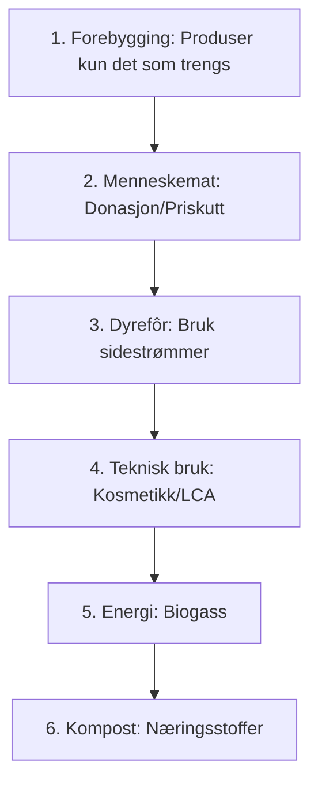

# SEC-MAT-01: Regulering og Matsvinn i Matindustrien
#sektor-mat #matsvinn #regulering #farm-to-fork #matsvinnloven

## Oversikt
Matsektoren står overfor strenge nye krav for å redusere svinn og øke [[ENV-02-Sirkulaer-Oekonomi|sirkulariteten]]. I Norge er vi i front med en egen matsvinnlov som trer i kraft i 2026. Se [[SEC-MAT-REG-01-Matsvinn-Detaljert-Lovverk|SEC-MAT-REG-01]] for detaljert lovverk.

## Matsvinnloven (Norge, vedtatt 2025)
Dette er en banebrytende lov som pålegger hele verdikjeden ansvar for å redusere matkastingen.
*   **Aktsomhetsplikt:** Alle matbedrifter (produksjon, grossist, detaljist, servering) må utføre aktsomhetsvurderinger for å identifisere svinn-risiko.
*   **Prisreduksjon:** Bedrifter pålegges å sette ned prisen på varer som nærmer seg utløpsdato og aktivt promotere disse.
*   **Donasjonsplikt:** Det skal legges til rette for at overskuddsmat som er trygg å spise, doneres fremfor å kastes.

## Bransjeavtalen om reduksjon av matsvinn
En frivillig avtale mellom myndighetene og matbransjen i Norge.
*   **Mål:** 50 % reduksjon i matsvinn innen 2030 (i tråd med FNs bærekraftsmål 12.3).
*   **Status 2024:** Dagligvarehandelen har allerede redusert svinnet med 31 % siden 2015.

## EU: Farm to Fork & Avfallsdirektivet
*   **Juridisk bindende mål:** EU innfører nå mål for matsvinn-reduksjon som medlemslandene må nå innen 2030 (10 % i produksjon, 30 % i detaljhandel/forbruker).
*   **Breakfast Directives:** Nye regler for tydeligere merking av opprinnelse og sukkerinnhold for å hjelpe forbrukere å kaste mindre.

## Matsvinn-hierarkiet

## Kilder
*   [Regjeringen.no - Matsvinnloven](https://www.regjeringen.no)
*   [Matsentralen Norge](https://www.matsentralen.no)
*   [EU Commission - Food Waste](https://ec.europa.eu/food/safety/food_waste_en)

## Se også
- [[REG-01-CSRD-ESRS|REG-01: CSRD og ESRS]]
- [[ENV-02-Sirkulaer-Oekonomi|ENV-02: Sirkulær Økonomi]]
- [[SEC-MAT-REG-01-Matsvinn-Detaljert-Lovverk|SEC-MAT-REG-01: Matsvinn – Detaljert Lovverk]]
