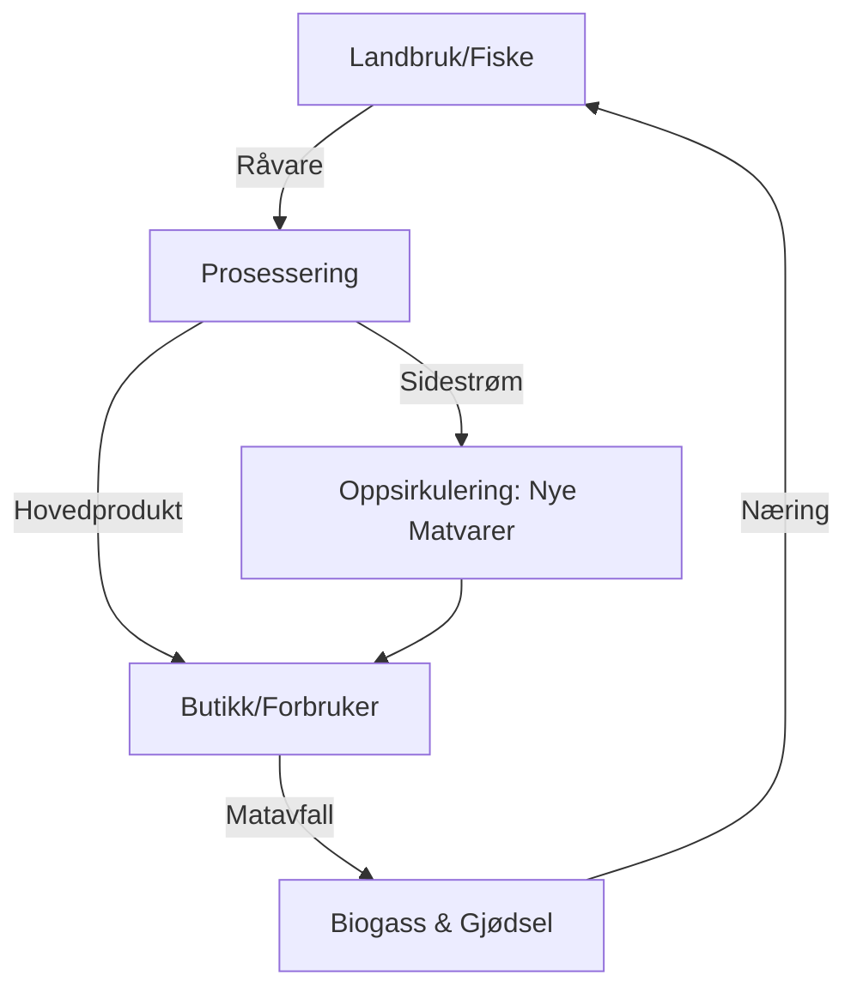

# SEC-MAT-02: Sirkulære Prosesser og Bioøkonomi
#sektor-mat #bioøkonomi #oppsirkulering #regenerativt-landbruk #sidestrømmer

## Oversikt
Sirkulære prosesser i matindustrien handler om å utnytte hele råvaren. Bioøkonomien gjør det mulig å transformere det som før ble regnet som "avfall" til verdifulle ressurser for mat, fôr eller nye materialer. Se [[ENV-02-Sirkulaer-Oekonomi|ENV-02: Sirkulær Økonomi]] for overordnet rammeverk.

## Oppsirkulering av Sidestrømmer (Upcycling)
Dette er prosessen der biprodukter fra matproduksjon foredles til nye menneskemat-produkter.
*   **Fiskesektor:** Utnyttelse av hoder, rygger og innmat til peptider, oljer og proteiner (se [[SEC-MAT-PROD-01-Nordisk-Havbruk-og-For|havbruk og fôr]]).
*   **Landbruk:** Bruk av "skjeve" grønnsaker og kornrester (spent grain) fra bryggerier til nye matprodukter (f.eks. kornbarer eller mel).
*   **Eksempel:** Prosjekter som Hailia og LIFE CONQUER viser hvordan fiskesiderstrømmer kan bli fullverdige matprodukter.

## Regenerativt Landbruk i et Sirkulært System
[[SEC-MAT-PROD-02-Regenerativt-Landbruk-Norden|Regenerativt landbruk]] bygger opp jordhelsen samtidig som det produserer mat:
*   **Lukkede næringskretsløp:** Bruk av husdyrgjødsel og kompost for å redusere behovet for kunstgjødsel.
*   **Karbonlagring:** No-till metoder og dekkvekster som binder karbon i jorda.
*   **Biodiversitet:** Integrasjon av trær og varierte vekstskifter som styrker økosystemet.

## Næringsstoff-gjenvinning
Nitrogen og fosfor er kritiske ressurser som ofte går tapt. Sirkulære systemer fokuserer på:
1.  **Gjenvinning av fosfor** fra kloakkslam og matavfall.
2.  **Organisk gjødsel** som erstatter fossilbasert kunstgjødsel.

## Bio-økonomisk Verdi-loop

## Kilder
*   [Innovation Norway - Bioøkonomi](https://www.innovasjonnorge.no)
*   [Ellen MacArthur Foundation - Circular Food](https://www.ellenmacarthurfoundation.org/food)
*   [Agro2Circular EU Project](https://agro2circular.eu)

## Se også
- [[ENV-02-Sirkulaer-Oekonomi|ENV-02: Sirkulær Økonomi]]
- [[SEC-MAT-PROD-01-Nordisk-Havbruk-og-For|SEC-MAT-PROD-01: Nordisk Havbruk og Fôr]]
- [[SEC-MAT-PROD-02-Regenerativt-Landbruk-Norden|SEC-MAT-PROD-02: Regenerativt Landbruk]]
- [[SEC-MAT-TEK-01-Fremtidens-Matteknologi|SEC-MAT-TEK-01: Fremtidens Matteknologi]]
