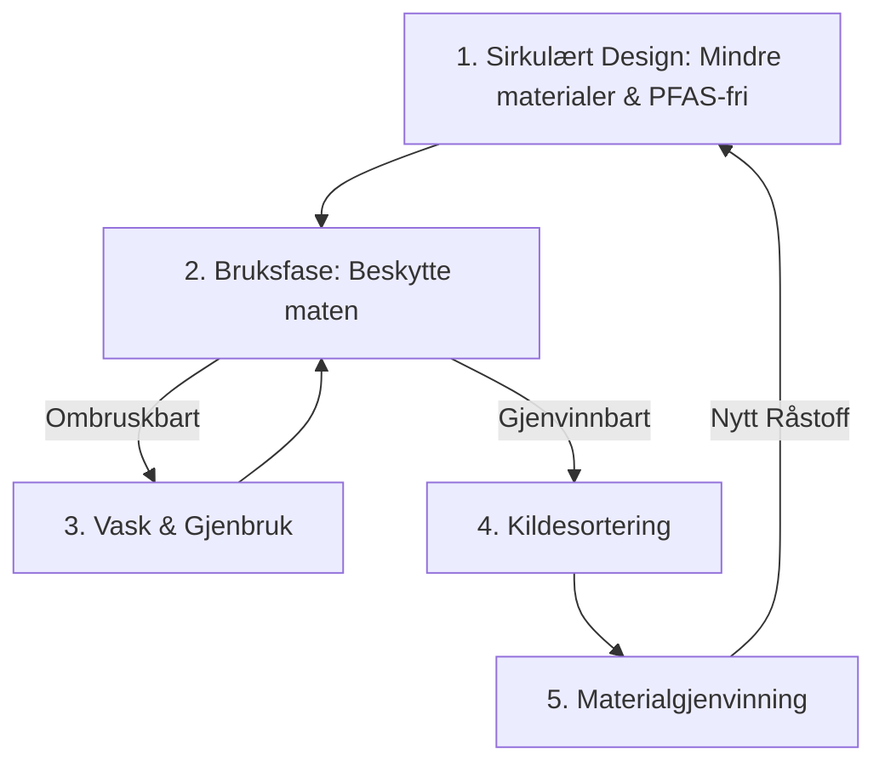

# SEC-MAT-03: Emballasje og PPWR i Matsektoren
#sektor-mat #emballasje #ppwr #plast #sirkularitet #pfas

## Oversikt
Emballasje i matsektoren har en dobbeltrolle: Den skal beskytte maten og redusere svinn, men den genererer også enorme mengder avfall. EUs nye emballasjeforordning (PPWR) endrer spillereglene fundamentalt. Se [[SEC-MAT-REG-02-Emballasje-i-Matsektoren-Detalj|SEC-MAT-REG-02]] for detaljert teknisk mapping.

## PPWR (Packaging and Packaging Waste Regulation)
Dette er en omfattende EU-forordning som trer i kraft i 2024/2025.
*   **Gjenvinnbarhet:** All emballasje skal være gjenvinnbar innen 2030, og "skalerbar gjenvinning" skal være på plass innen 2035.
*   **Plastforbud (fra 2030):** Engangsemballasje i plast forbys for:
    *   Ubearbeidet fersk frukt og grønt (under 1,5 kg).
    *   Enkeltporsjoner i serveringsbransjen (f.eks. saus, sukker, fløte).
    *   Mat og drikke som konsumeres på stedet i HORECA-sektoren.
*   **PFAS-forbud:** Forbud mot "evighetskjemikalier" i matkontaktmateriell (forventet i kraft i 2026).

## Sirkulære Emballasje-systemer
*   **Ombruk (Reuse):** Krav om at en viss andel av emballasjen skal kunne brukes på nytt (f.eks. gjennom pantesystemer eller gjenfylling).
*   **Resirkulert innhold:** Krav om at ny plastemballasje må inneholde en minimumsandel resirkulert plast (30-65 % innen 2030).
*   **Bioplast:** Bruk av fornybare ressurser (som tang eller stivelse) for å lage komposterbar eller bio-basert emballasje.

## Utfordringer: Matsvinn vs. Emballasje
Det er en hårfin balansegang mellom å redusere emballasje og å øke matsvinn. [[ENV-02-Sirkulaer-Oekonomi|Sirkulær]] design i matindustrien må derfor alltid vurdere produktets totale livssyklus (LCA).

## Emballasje-kretsløp

## Kilder
*   [EU Commission - Packaging Waste](https://ec.europa.eu/environment/waste/packaging/index_en.htm)
*   [Grønt Punkt Norge - PPWR](https://www.grontpunkt.no)
*   [Packaging Europe - PPWR Updates](https://packagingeurope.com)

## Se også
- [[REG-07-Produkt-og-Miljoregler-Detalj|REG-07: Produkt- og Miljøregler]]
- [[SEC-MAT-REG-02-Emballasje-i-Matsektoren-Detalj|SEC-MAT-REG-02: Emballasje i Matsektoren – Detalj]]
- [[ENV-02-Sirkulaer-Oekonomi|ENV-02: Sirkulær Økonomi]]
