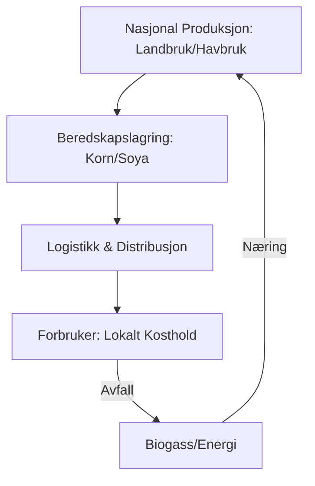

# SEC-MAT-KOST-01: Nordisk Kosthold og Beredskap
#sektor-mat #kosthold #beredskap #selvforsyning #norden #halsa

## Oversikt
Bærekraftig mat i Norden handler ikke bare om produksjonsmetoder, men også om hva vi spiser og hvor robuste våre matsystemer er i møte med kriser. Se [[SEC-MAT-01-Regulering-og-Matsvinn|SEC-MAT-01]] for regulering av matsvinn.

## Det Nye Nordiske Kostholdet (New Nordic Diet - NND)
NND er et bærekraftig og sunt alternativ til det tradisjonelle vestlige kostholdet:
*   **Sentrale Ingredienser:** Fullkorn (spesielt rug og havre), bær, rotfrukter, kål, fet fisk (sild, makrell, [[SEC-MAT-PROD-01-Nordisk-Havbruk-og-For|laks]]) og rapsolje.
*   **Miljømessige fordeler:** Fokus på lokale råvarer i sesong reduserer transportutslipp og støtter lokalt landbruk.
*   **Helsefordeler:** NND er dokumentert å redusere risiko for hjerte- og karsykdommer og diabetes.

## Selvforsyning og Matsikkerhet (Status 2024)
Geopolitisk usikkerhet har gjort matberedskap til en topp-prioritet i de nordiske landene.
*   **Norge:** Selvforsyningsgraden på ca. 47 % ses på som sårbar. Regjeringen har et mål om 50 % (korrigert for importert fôr). Det er et sterkt fokus på å øke norsk korn- og grøntproduksjon.
*   **Finland:** Har den høyeste selvforsyningsgraden i Norden (~80+ %) takket være en sterk nasjonal strategi for beredskapslagring.
*   **Sverige:** Har i økende grad fokusert på beredskap etter mange år med nedbygging av lagre.

## Proteinskiftet
For å øke både bærekraft og selvforsyning, må Norden gjennom et proteinskifte:
1.  **Redusert kjøttforbruk:** Spesielt av rødt kjøtt som har høyt klimaavtrykk.
2.  **Økt plantebasert protein:** Dyrking av erter, bønner og lupiner som trives i nordisk klima.
3.  **Bruk av blå proteiner:** Utnytte mer av bifangst og lavtrofiske arter (skjell, kråkeboller).

## Beredskapsmodell for Mat

## Kilder
*   [Nordiske Næringsstoffanbefalinger (NNR 2023)](https://www.norden.org)
*   [Regjeringen.no - Matsikkerhet og Beredskap](https://www.regjeringen.no)
*   [NIBIO - Selvforsyningsgrad i Norge](https://nibio.no)

## Se også
- [[SEC-MAT-01-Regulering-og-Matsvinn|SEC-MAT-01: Regulering og Matsvinn]]
- [[SEC-MAT-PROD-01-Nordisk-Havbruk-og-For|SEC-MAT-PROD-01: Nordisk Havbruk og Fôr]]
- [[SEC-MAT-PROD-02-Regenerativt-Landbruk-Norden|SEC-MAT-PROD-02: Regenerativt Landbruk i Norden]]
