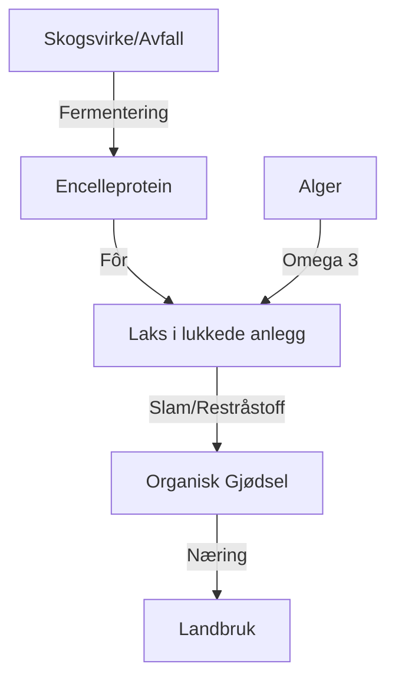

# SEC-MAT-PROD-01: Nordisk Havbruk og Fôr-revolusjonen
#sektor-mat #havbruk #fôr #norden #innovasjon #blå-bioøkonomi

## Oversikt
Norden, og spesielt Norge, er verdensledende på havbruk. Sektoren står overfor et paradigmeskifte fra åpne merder til lukkede systemer, kombinert med en radikal endring i fôrets sammensetning. Se [[SEC-MAT-02-Sirkulaere-Prosesser-og-Biooekonomi|SEC-MAT-02: Sirkulære Prosesser]] for kontekst om [[ENV-08-Vann-og-Marine-Ressurser-Teknisk-Detalj|marine ressurser]] og bioøkonomi.

## Overgang til Lukkede Anlegg (Closed-Containment)
For å løse utfordringer med lakselus, rømming og lokale utslipp, beveger industrien seg mot:
*   **Landbasert Oppdrett:** Full kontroll over vannmiljøet, men energikrevende.
*   **Lukkede Merder i Sjø:** Beskytter mot lus og samler opp slam (biorester) som kan brukes til gjødsel eller energi.
*   **Offshore Havbruk:** Flytter produksjonen lenger ut til havs for bedre vannutskifting og mindre miljøpåvirkning på kysten.

## Den Nye Fôr-miksen (Fôr-revolusjonen)
Fôr utgjør over 75 % av [[ENV-01-Klimaregnskap-GHG|klimaavtrykket]] til oppdrettslaks. Målet er å erstatte importert soya med regionale, lav-trofiske ressurser:
1.  **Insektprotein:** Bruk av sort soldatflue som fores med matavfall.
2.  **Mikroalger:** Kilde til Omega-3 som ikke krever fiskeolje (f.eks. *Schizochytrium*).
3.  **Tre-basert Protein:** Fermentering av sukker fra norsk skogvirke til encelleproteiner (SCP).
4.  **Tang og Tare:** Bruk av makroalger som ingrediens og karbonbinder.

## Sirkulær Blå Bioøkonomi

## Viktige Prosjekter & Aktører
*   **NON-Fôr:** Forskningsprosjekt på nasjonale fôringredienser.
*   **Millennial Salmon:** Veikart for laks basert utelukkende på bærekraftige ingredienser.
*   **Origin by Ocean:** Finsk startup som utvinner verdier fra alger og blågrønne alger.

## Kilder
*   [Nofima - Fremtidens fôringredienser](https://nofima.no)
*   [Nordisk Ministerråd - Blå Bioøkonomi](https://www.norden.org)
*   [Sjømat Norge - Miljøstandarder](https://sjomatnorge.no)

## Se også
- [[ENV-08-Vann-og-Marine-Ressurser-Teknisk-Detalj|ENV-08: Vann og Marine Ressurser]]
- [[ENV-01-Klimaregnskap-GHG|ENV-01: Klimaregnskap og GHG]]
- [[SEC-MAT-02-Sirkulaere-Prosesser-og-Biooekonomi|SEC-MAT-02: Sirkulære Prosesser og Bioøkonomi]]
