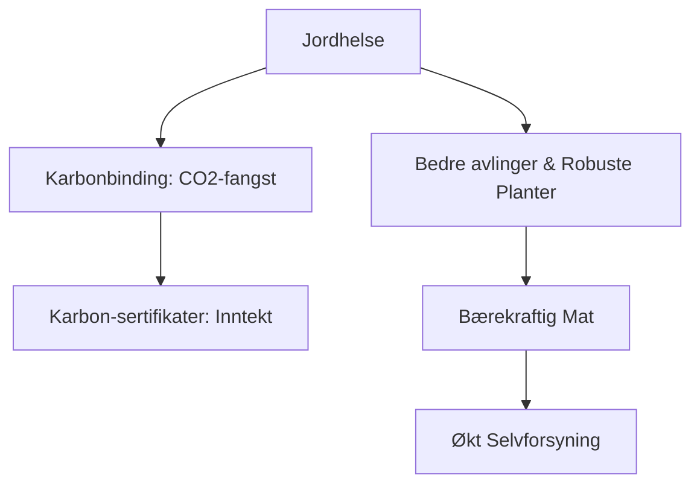

# SEC-MAT-PROD-02: Regenerativt Landbruk i Nordisk Klima
#sektor-mat #landbruk #norden #regenerativt #karbonbinding #jordhelse

## Oversikt
Regenerativt landbruk i Norden står overfor spesielle utfordringer og muligheter på grunn av de lange vintrene og den korte vekstsesongen. Fokus er på å bygge opp jordhelsen og bruke jorda som en karbonvask (carbon sink). Se [[SEC-MAT-02-Sirkulaere-Prosesser-og-Biooekonomi|SEC-MAT-02: Sirkulære Prosesser]] for bredere kontekst.

## Sentrale Metoder for Nordisk Klima
*   **Minimal Jordarbeiding (No-till):** Reduserer tap av karbon og beskytter mikrolivet i jorda mot frost og tørke.
*   **Vintergrønne marker (Cover crops):** Bruk av dekkvekster som holder på næringsstoffene gjennom vinteren og hindrer erosjon ved snøsmelting.
*   **Beitestyring (Virtual Fencing):** Bruk av GPS-halsbånd (f.eks. Nofence) for å kontrollere beiting, slik at jorda får restituere seg og binde mer karbon.
*   **Agroforestry (Skoglandbruk):** Kombinasjon av trær og matproduksjon for å øke [[ENV-10-Biodiversitet-Maaling-Modeller-Norden|biodiversitet]] og vindskjerming i åpent landskap.

## Karbonkreditter og Økonomi
Norden ser nå en fremvekst av teknologier som kobler bønder mot karbonmarkedet:
*   **Agreena:** En plattform som verifiserer karbonbinding i jorda og utsteder sertifikater som bønder kan selge til selskaper for å finansiere omstillingen.
*   **Karbonfangst i skogjord:** Spesielt viktig i Sverige og Finland med deres enorme skogarealer.

## Selvforsyning vs. Eksport
Norden er en stor eksportør av fisk og meieriprodukter, men har lav selvforsyningsgrad på korn og proteiner til menneskemat (spesielt i Norge). Regenerativ omstilling ses også som et verktøy for å øke den caloric self-sufficiency ved å utnytte lokale ressurser bedre.

## Sammenheng i Regenerativt Landbruk

## Kilder
*   [Agreena - Regenerative Agriculture](https://agreena.com)
*   [EASAC Report 2024 - Carbon in Soils](https://easac.eu)
*   [NIBIO - Norsk institutt for bioøkonomi](https://nibio.no)

## Se også
- [[ENV-07-Natur-og-Areal-Teknisk-Detalj|ENV-07: Natur og Arealbruk]]
- [[ENV-10-Biodiversitet-Maaling-Modeller-Norden|ENV-10: Biodiversitet]]
- [[SEC-MAT-02-Sirkulaere-Prosesser-og-Biooekonomi|SEC-MAT-02: Sirkulære Prosesser og Bioøkonomi]]
