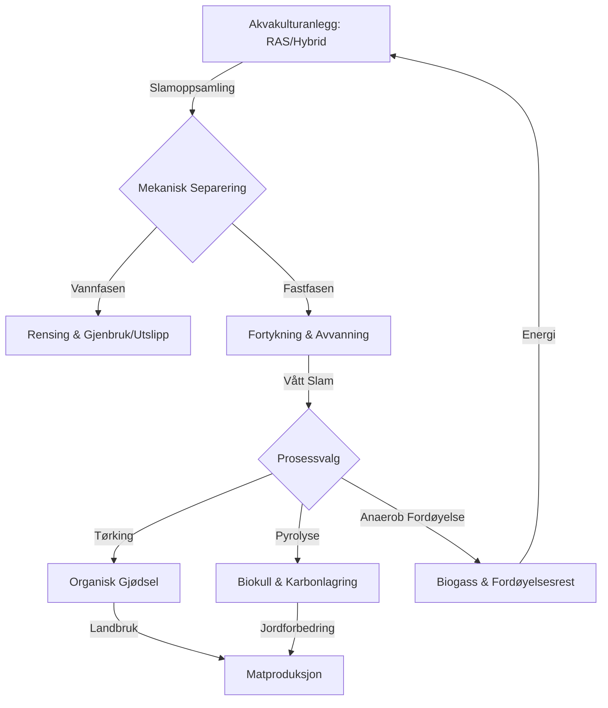

# SEC-MAT-PROD-03: Blå Bioøkonomi – Teknisk Detalj (Teknisk Dypdykk)

> **Oversiktsdokument:** [[SEC-MAT-PROD-01-Nordisk-Havbruk-og-For|SEC-MAT-PROD-01: Nordisk Havbruk og Fôr]]

Dette dokumentet gir en uttømmende teknisk kartlegging av den blå bioøkonomien med fokus på sirkulær akvakultur, tekniske systemvalg og regulatoriske oppdateringer for 2024/2025. Se også [[ENV-08-Vann-og-Marine-Ressurser-Teknisk-Detalj|ENV-08: Vann og Marine Ressurser]] for bredere miljøkontekst.

## 1. Tekniske Systemer: RAS vs. Hybrid- og Lukkede Anlegg
Utviklingen i norsk akvakultur drives av behovet for biosikkerhet (lakselus) og miljøkontroll. Benchmarks for 2024/2025 viser en tydelig dreining mot "post-smolt"-strategier.

### 1.1 RAS (Recirculating Aquaculture Systems)
RAS-teknologien gjenbruker inntil 99% av vannet gjennom mekanisk og biologisk filtrering.
*   **Tekniske Benchmarks (Nofima 2024/2025):**
    *   **H2S-håndtering:** Ny forskning identifiserer kritiske grenseverdier for hydrogensulfid (H2S). Moderne RAS-anlegg implementerer nå sensor-basert sanntidsovervåking for å unngå massedød.
    *   **Nitrogenfjerning:** Økt fokus på denitrifisering for å opprettholde vannkvalitet ved høyere tetthet.
    *   **Presisjonsfôring:** Bruk av AI og datasyn (Computer Vision) for å minimere fôrspill, som er avgjørende for vannkvaliteten i lukkede systemer.

### 1.2 Hybrid- og Semi-lukkede systemer
Kombinerer fordeler fra landbasert kontroll med sjøbasert volum.
*   **Teknisk konsept:** Pumper lusefritt vann fra dypet (under lusebeltet) inn i flytende, lukkede eller semi-lukkede poser/tanker i sjøen.
*   **Post-smolt strategi:** Fisk holdes i lukkede systemer til de er 500g–1kg før utsett i åpne merder. Dette reduserer eksponeringstiden for lus med opptil 50%.

| Parameter | RAS (Landbasert) | Hybrid/Semi-lukket (Sjø) |
| :--- | :--- | :--- |
| **Vannkontroll** | Total kontroll (Temp/O2/Salinitet) | Delvis kontroll (Temp følger dypvann) |
| **Energibehov** | Høyt (pumping og rensing) | Medium (kun pumping) |
| **Arealbehov** | Landareal / Industritomt | Eksisterende sjølokaliteter |
| **Lusrisiko** | Minimal/Ingen | Svært lav (dypvannsinntak) |

---

## 2. Sirkulær Verdikjede: Slamutnyttelse
Slam fra akvakultur (fôrspill og ekskrementer) er en strategisk ressurs for fosfor- og nitrogen-gjenvinning.

### 2.1 Prosesseringsteknologi
*   **Tørking og Granulering:** Foretrukket metode i 2024 for å beholde plantetilgjengelig fosfor og nitrogen. Tørket slam er transportabelt og fungerer som organisk gjødsel.
*   **Pyrolyse (Biokull):** Tekniske utfordringer identifisert i 2024 inkluderer tap av nitrogen i gassfasen og dannelse av tungt tilgjengelige kalsiumfosfater ved høy temperatur. Biokull er imidlertid overlegent for karbonlagring og jordforbedring.

### 2.2 Sirkulær Systemoversikt (Mermaid)

---

## 3. Regulatorisk Landskap 2024/2025
Norge og EU strammer inn kravene til dyrevelferd og miljødokumentasjon.

### 3.1 Mattilsynet og Nasjonale Oppdateringer
*   **Dyrevelferdsmeldingen (Meld. St. 8 2024–2025):** Regjeringens nye melding varsler strengere krav til dokumentert velferd før ny teknologi tas i bruk.
*   **Ny Akvakulturforskrift (Roadmap 2027):** Mattilsynet har i 2025 startet arbeidet med en felles, modernisert forskrift for fiskevelferd som vil erstatte dagens spredte regelverk.
*   **Mekanisk Avlusing:** Strenge restriksjoner på metoder som påfører fisken smerte (termisk/mekanisk), med økt krav til sanntids velferdsovervåking under behandling.

### 3.2 EU Animal Welfare Reforms (2024/2025)
*   **EURCAW-Aqua:** Det nye EU-referansesenteret for fiskevelferd er operativt fra 2024 og setter standarder for transport og slakting.
*   **Stunning-krav:** EU beveger seg mot obligatoriske krav om bedøving før slakt for alle oppdrettsarter.
*   **Importstandarder:** EU signaliserer at import fra land utenfor EU (inkludert Norge) må møte tilsvarende velferdsstandarder for å opprettholde markedstilgang.

---

## 4. Verifikasjon og Kilder
Tekniske data i dette dokumentet er verifisert mot:
*   **Nofima (2024/2025):** Rapporter fra "Fremtidens Smoltproduksjon" og H2S-risikoanalyser.
*   **Mattilsynet (2024/2025):** Stortingsmelding om dyrevelferd og høringsutkast for landbasert oppdrett.
*   **NIBIO (2024):** Forskningsresultater fra AquaPhoenix og SEA2LAND vedrørende slamutnyttelse.

*Sist oppdatert: Februar 2025*

## Se også
- [[SEC-MAT-PROD-01-Nordisk-Havbruk-og-For|SEC-MAT-PROD-01: Nordisk Havbruk og Fôr]]
- [[ENV-08-Vann-og-Marine-Ressurser-Teknisk-Detalj|ENV-08: Vann og Marine Ressurser]]
