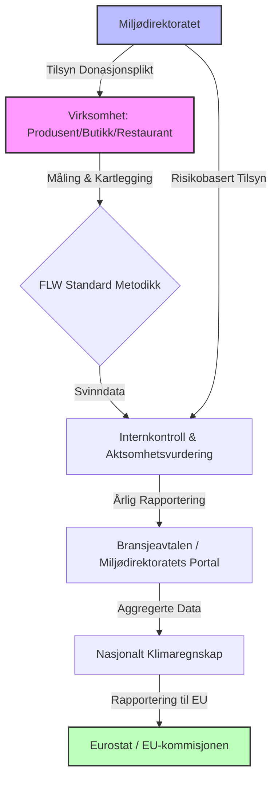

# SEC-MAT-REG-01: Matsvinn – Detaljert Lovverk (Norge & EU)

> **Oversiktsdokument:** [[SEC-MAT-01-Regulering-og-Matsvinn|SEC-MAT-01: Regulering og Matsvinn i Matindustrien]]

Denne rapporten gir en teknisk gjennomgang av det regulatoriske landskapet for matsvinn per 2025, med fokus på den nye norske matsvinnloven, EUs reviderte avfallsdirektiv, og internasjonale standarder for måling og rapportering (FLW Standard).

---

## 1. Den Norske Matsvinnloven (Prop. 130 L (2024–2025))

Den norske matsvinnloven markerer et skifte fra frivillig bransjeavtale til juridisk bindende krav. Loven ble vedtatt av Stortinget i mai 2025 og forventes å tre i kraft i løpet av 2026, når utfyllende forskrifter er ferdigstilt av Miljødirektoratet.

### 1.1 Overordnede krav til aktører
Loven pålegger virksomheter i matverdikjeden (produsenter, grossister, detaljist og servering) fire hovedplikter:

| Krav | Beskrivelse | Ansvarlig instans |
|:---|:---|:---|
| **Aktsomhetsvurdering** | Kartlegging av risiko for matsvinn i egen drift og verdikjede, samt iverksetting av forebyggende tiltak. | Virksomheten |
| **Donasjonsplikt** | Plikt til å donere overskuddsmat til matsentraler eller veldedighet dersom det er praktisk og hygienisk forsvarlig. | Produsenter/Grossister |
| **Nedprisingskrav** | Krav om aktiv nedprising og markedsføring av varer som nærmer seg utløpsdato (f.eks. egne "snart utgått"-soner). | Detaljhandel |
| **Rapporteringsplikt** | Dokumentasjon av tiltak og faktiske svinntall skal være tilgjengelig for tilsynsmyndigheten. | Miljødirektoratet (Tilsyn) |

### 1.2 Sektor-spesifikke detaljer
*   **Matindustri/Produksjon:** Fokus på systematiske kutt i produksjonssvinn og krav om avtaler med donasjonspartnere.
*   **Dagligvarehandel:** Skal dokumentere effekt av nedprising vs. donasjon vs. kasting.
*   **Servering (HORECA):** Krav om måling av tallerkensvinn og buffésvinn, med dokumenterte reduksjonsmål.

---

## 2. EU Waste Framework Directive (Revisjon 2025)

Direktiv (EU) 2025/1892 trådte i kraft 16. oktober 2025. Dette er den første EU-lovgivningen som setter juridisk bindende mål for reduksjon av matsvinn i medlemslandene (og EØS-relevante parter).

### 2.1 Bindende reduksjonsmål for 2030
Målene er satt mot et basisnivå (baseline) basert på gjennomsnittlig svinn i perioden 2021–2023.

*   **Prosessering og produksjon:** 10 % reduksjon innen 31. desember 2030.
*   **Detaljhandel, servering og husholdning:** 30 % reduksjon per kapita innen 31. desember 2030.

### 2.2 Tidslinje og implementering
*   **Juni 2027:** Siste frist for nasjonal gjennomføring i medlemslandenes lovverk.
*   **Desember 2027:** EU-kommisjonen skal gjennomføre en evaluering for å vurdere om målene skal skjerpes for 2035 (opp mot 50 % reduksjon for å møte SDG 12.3).
*   **Dato-merking:** Nye retningslinjer for å skille tydeligere mellom "Best før" (kvalitet) og "Siste forbruksdag" (trygghet).

---

## 3. Teknisk Målestandard: FLW Standard

For å møte de nye lovkravene må virksomheter benytte en standardisert metodikk. **Food Loss and Waste Accounting and Reporting Standard (FLW Standard)** er den globale referanserammen.

### 3.1 Definisjon av Scope (Omfang)
En fullstendig FLW-inventur krever spesifisering av:
1.  **Tidsramme:** Rapporteringsperiode (typisk kalenderår).
2.  **Materialtype:** Skille mellom mat (spiselig) og uunngåelig svinn (bein, skall, kaffegrut).
3.  **Destinasjon:** Hvor havner avfallet? (Biogass, kompost, forbrenning, deponi).
4.  **Grensesnitt:** Geografisk område og organisatorisk enhet.

### 3.2 Kvantifiseringsmetoder
Virksomheter kan velge metode basert på nøyaktighetskrav:
*   **Direkte veiing:** Høyest nøyaktighet, brukes ofte i servering og produksjon.
*   **Massebalanse:** Beregning basert på innkjøpt volum minus solgt volum (vanlig i industri).
*   **Sammensetningsanalyse:** Fysisk sortering av avfallsbeholdere for å finne prosentandel mat.
*   **Proxy-data:** Bruk av bransjesnitt (kun tillatt for små aktører eller som estimat).

---

## 4. Rapporteringsflyt og Tilsyn (Mermaid)

Under det nye regimet i Norge (2025/2026) vil informasjonsflyten følge dette mønsteret:

---

## 5. Verifikasjon og Oppdateringer (2024/2025)

*   **Miljødirektoratet (2024-utvalg):** Har presisert at "aktsomhetsvurderinger" for matsvinn skal følge samme metodikk som Åpenhetsloven, men med miljøfokus.
*   **EU-parlamentet (Sept 2025):** Vedtok endelig tekst for WFD-revisjonen, som inkluderer obligatorisk utvidet produsentansvar (EPR) for tekstiler, men som også legger press på medlemslandene om å inkludere primærproduksjon (landbruk) i nasjonale planer innen 2026.

---
**Dokument-ID:** SEC-MAT-REG-01
**Sist Oppdatert:** Oktober 2025
**Status:** Aktiv / Teknisk Mapping

## Se også
- [[SEC-MAT-01-Regulering-og-Matsvinn|SEC-MAT-01: Regulering og Matsvinn (Oversikt)]]
