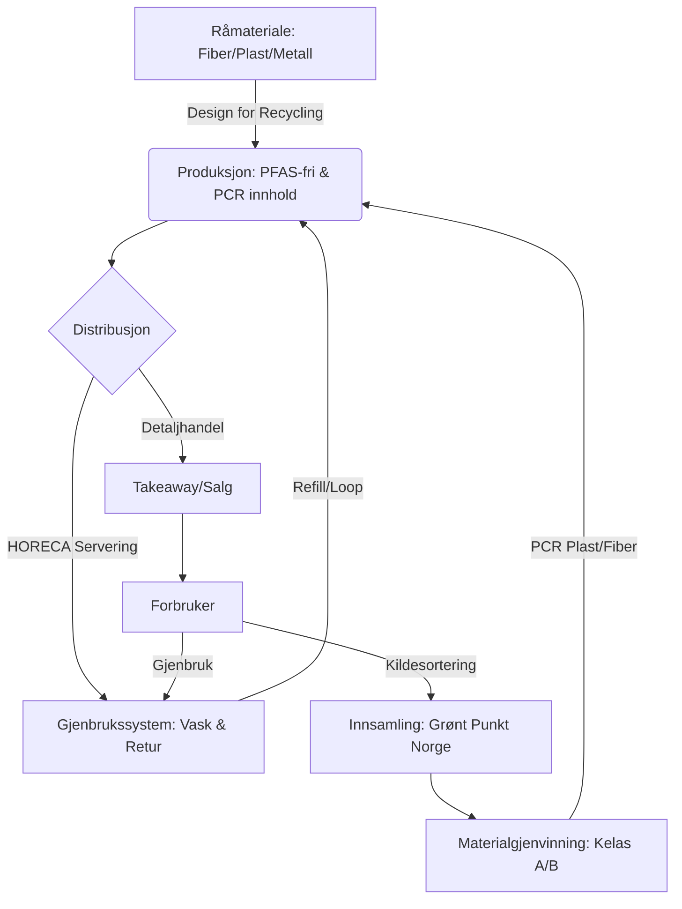

# SEC-MAT-REG-02: Emballasje i Matsektoren – Teknisk Mapping (PPWR)

> **Oversiktsdokument:** [[SEC-MAT-03-Emballasje-og-PPWR|SEC-MAT-03: Emballasje og PPWR]]

Dette dokumentet gir en uttømmende teknisk mapping av sirkulær emballasje i matsektoren, med fokus på EUs nye emballasjeforordning (**PPWR - Regulation (EU) 2025/40**) og dens implementering i et nordisk perspektiv (Grønt Punkt Norge). Se også [[REG-07-Produkt-og-Miljoregler-Detalj|REG-07: Produkt- og Miljøregler]] for bredere produktregulering.

## 1. Regulatorisk Rammeverk: PPWR (2025/40)
PPWR ble offisielt publisert 22. januar 2025 og trådte i kraft i EU 11. februar 2025. Forordningen erstatter emballasjedirektivet fra 1994 og innfører harmoniserte krav i hele EØS-området.

### Sentrale Tidslinjer
| Dato | Hendelse |
| :--- | :--- |
| **11. feb 2025** | PPWR trer i kraft i EU. |
| **1. juli 2025** | Norge fjerner 1000 kg-grensen for produsentansvar (Grønt Punkt Norge). |
| **12. aug 2026** | **PFAS-forbud** trer i kraft for matkontaktmaterialer. |
| **Aug 2026** | Forventet implementering av PPWR i norsk lovgivning (Avfallsforskriften). |
| **1. jan 2030** | Forbud mot visse engangsformater og krav til 10 % gjenbruk i takeaway. |
| **1. jan 2035** | Krav om at all emballasje må være gjenvinnbar "at scale". |

---

## 2. PFAS-forbud i Matkontaktmaterialer (2026)
Fra **12. august 2026** innføres et de facto forbud mot "evighetskjemikalier" (PFAS) i emballasje som er beregnet for kontakt med mat. Dette er særlig kritisk for fiberbasert emballasje (papp, papir, formpresset fiber) som i dag bruker PFAS for fett- og vannbarriere.

### Tekniske Grenseverdier
For at emballasjen skal anses som PFAS-fri, må den ligge under følgende terskler:
- **Enkelt-PFAS:** < 25 ppb (parts per billion).
- **Sum av PFAS:** < 250 ppb (målte verdier).
- **Total Fluor (screening):** < 50 ppm (parts per million).

### Berørte Produkter
- Pizzaesker og fastfood-innpakning.
- Mikrobølgepopcorn-poser.
- Formpressede fiberprodukter (salatskåler, tallerkener).
- Fettbestandig papir (bakeripapir, mellomleggspapir).

---

## 3. HORECA & Takeaway: Gjenbruk og Forbud
PPWR retter seg spesifikt mot serveringsbransjen (Hotell, Restaurant, Kafé) for å redusere mengden engangsemballasje.

### Restriksjoner fra 1. januar 2030
1. **Servering på stedet:** Forbud mot engangsemballasje (tallerkener, kopper, bokser) for mat og drikke som konsumeres i lokalet, dersom emballasjen inneholder mer enn 5 % plast.
2. **Porsjonspakninger:** Forbud mot små engangspakninger for krydder, sauser, sukker og fløte (gjelder ikke takeaway).
3. **Frukt og Grønt:** Forbud mot engangsplast for fersk frukt og grønnsaker under 1,5 kg (unntak for ømfintlige produkter).

### Gjenbruksmål for Takeaway
- **2030:** Aktører i takeaway-sektoren skal "tilstrebe" at **10 %** av salget skjer i gjenbrukbar emballasje.
- **Kunde-rett:** Forbrukere skal ha rett til å bruke egen medbrakt emballasje uten ekstra kostnad.

---

## 4. Gjenvinnbarhet og Design for Recycling (DfR)
PPWR innfører strenge krav til hvordan emballasje skal designes for å sikre høyest mulig gjenvinningsgrad.

### Ytelsesklasser (Recyclability Performance Grades)
Innen 2030 må all emballasje kategoriseres i klasser basert på gjenvinnbar vektandel:
- **Klasse A:** ≥ 95 % gjenvinnbar.
- **Klasse B:** ≥ 80 % gjenvinnbar.
- **Klasse C:** ≥ 70 % gjenvinnbar (Fases ut fra 2038).
- **Klasse D/E:** Under 70 % (Vil bli forbudt fra 2030).

### Krav til Resirkulert Materiale (PCR) i Plast
For å skape et marked for resirkulert plast, settes obligatoriske minimumskrav for 2030:
- **Kontaktsensitiv PET (mat):** 30 %.
- **Annen kontaktsensitiv plast (PP/PE):** 10 %.
- **Engangs drikkeflasker:** 30 %.

---

## 5. Livssyklus for Sirkulær Matemballasje (Visualisering)

---

## 6. Nordisk Kontekst & Grønt Punkt Norge (2024-2025)
Norge følger EUs krav gjennom EØS-avtalen, men med visse særnorske tilpasninger i regi av Miljødirektoratet og Grønt Punkt Norge.

### Produsentansvar (EPR) Oppdatering
- **Fjerning av 1000 kg-grensen:** Fra **1. juli 2025** må alle bedrifter som setter emballasje på markedet, uavhengig av mengde, være medlem i et produsentansvarsselskap. Dette treffer mange små lokalmatprodusenter og nisje-HORECA.
- **Miljøgradert vederlag:** Vederlaget til Grønt Punkt Norge vektes tyngre basert på emballasjens faktiske gjenvinnbarhet (Klasse A/B gir lavere kostnad).

### Komposteringskrav
Visse produkter **skal** være komposterbare innen to år etter implementering i Norge:
- Teposer og kaffekapsler.
- Klistremerker på frukt.
- Tynne plastposer (under 15 mikron) til løsvekt (f.eks. i fruktavdelingen).

---

## Kilder
1. EU Regulation 2025/40 (PPWR).
2. Grønt Punkt Norge: Veileder til PPWR 2024/2025.
3. Miljødirektoratet: Endringer i Avfallsforskriften.
4. EU Council Update (2024): Technical thresholds for PFAS in FCM.

## Se også
- [[SEC-MAT-03-Emballasje-og-PPWR|SEC-MAT-03: Emballasje og PPWR (Oversikt)]]
- [[REG-07-Produkt-og-Miljoregler-Detalj|REG-07: Produkt- og Miljøregler]]
