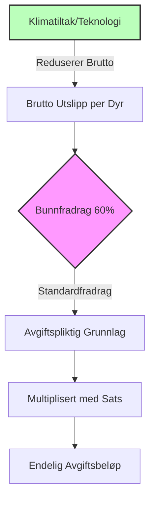

# SEC-MAT-REG-03: Danmark CO2-Avgift på Biologiske Prosesser (Landbruk)

## 1. Oversikt og Formål
I juni 2024 inngikk den danske regjeringen, sammen med representanter for landbruket, industrien, fagforeninger og naturvernsorganisasjoner, en historisk avtale kjent som **"Den grønne trepart"**. Avtalen gjør Danmark til det første landet i verden som innfører en CO2-avgift på biologiske utslipp fra husdyr.

Hovedmålet er å redusere landbrukets [[ENV-01-Klimaregnskap-GHG|klimagassutslipp]] med 1,8 millioner tonn CO2e innen 2030, samtidig som man muliggjør en massiv naturrestaurering og skogplanting.

## 2. Avgiftsmodell og Satser (2030–2035)
Avgiften er designet med en gradvis innfasing og et betydelig bunnfradrag for å sikre næringens konkurransekraft.

| År | Nominell Sats (DKK/t CO2e) | Bunnfradrag (%) | Effektiv Sats (DKK/t CO2e) |
| :--- | :--- | :--- | :--- |
| **2030** | 300 | 60 % | **120** |
| **2035** | 750 | 60 % | **300** |

### 2.1 Bunnfradraget (Bundfradrag)
Bunnfradraget på 60 % beregnes ut fra de gjennomsnittlige utslippene for de ulike dyretypene. Dette betyr at landmenn som implementerer utslippsreduserende tiltak (f.eks. fôrtilsetninger eller hyppig utslusing av gylle), vil få en enda lavere reell avgiftsbelastning.

## 3. Teknisk Beregningsgrunnlag
Avgiften baseres på **bedriftsnivå** (den enkelte gård). Siden direkte måling av metan fra kuer i felt ikke er praktisk mulig, benyttes en beregningsmodell basert på nasjonale utslippsfaktorer (Tier 2/3).

### 3.1 Gasstyper og GWP (Global Warming Potential)
Danmark benytter IPCCs standarder for omregning til CO2-ekvivalenter:
*   **Metan (CH4):** Enterisk fermentering (fordøyelse) og gjødselhåndtering. (GWP100: ~28).
*   **Lattergas (N2O):** Utslipp fra gjødsel på mark og i stald. (GWP100: ~273).

### 3.2 Utslippsfaktorer per Dyretype (Eksempler)
Estimert brutto utslipp før tiltak og fradrag:

| Dyretype | kg CH4 (Enterisk) | kg CH4 (Gjødsel) | Total t CO2e/år |
| :--- | :--- | :--- | :--- |
| **Malkeko (Melkeku)** | 130 – 160 | 20 – 30 | **4,5 – 5,5** |
| **Slagtesvin (Slaktegris)** | ~1,5 | ~4 | **0,12 – 0,15** |
| **So (Purke)** | ~5 | ~15 | **0,5 – 0,6** |

### 3.3 Beregningsformel (Forenklet)
Avgiften for en gård beregnes slik:
$$Avgift = \sum (Antall\ dyr \times Utslippsfaktor_{type} \times (1 - Bunnfradrag)) \times Sats_{år}$$

## 4. Godkjente Reduksjonstiltak
Landmenn kan redusere sitt avgiftsgrunnlag ved å dokumentere bruk av teknologier som er godkjent av myndighetene. Per 2024 er ca. 15 teknologier identifisert, inkludert:

1.  **Bovaer (3-NOP):** Fôrtilsetning som reduserer metanproduksjonen i magen på drøvtyggere med opptil 30 %.
2.  **Hyppig utslusing av gylle:** Reduserer metandannelse i staldanlegg.
3.  **Forsuring av gylle:** Kjemisk behandling som binder ammoniakk og reduserer utslipp.
4.  **Biogass:** Levering av gjødsel til biogassanlegg gir fradrag i utslippsregnskapet.

## 5. Provenuføring og Den Grønne Arealfond
Alle inntekter fra avgiftsordningen skal føres tilbake til landbrukssektoren for å støtte den grønne omstillingen.

*   **Omstillingsstøtte:** Midler til investering i ny teknologi.
*   **Den Grønne Arealfond:** Et fond på 43 milliarder DKK som skal finansiere:
    *   Reisning av **250 000 hektar** ny skog.
    *   Uttak av **140 000 hektar** lavbunnsjord (torvmyr) fra drift for å stoppe CO2-lekkasje.
    *   Reduksjon av nitrogenutslipp til kystnære farvann.

## 6. Implementeringsplan (Roadmap)
*   **2024/2025:** Lovforslag fremmes og vedtas i Folketinget.
*   **2025–2029:** Etablering av IT-systemer for innrapportering og kontroll.
*   **1. januar 2030:** Avgiften trer i kraft med en effektiv sats på 120 DKK/t CO2e.
*   **2035:** Satsen trappes opp til 300 DKK/t CO2e.

---
**Kilder:**
*   *Skatteministeriet: "Aftale om et Grønt Danmark" (Juni 2024).*
*   *Ekspertgruppen for en grøn skattereform (Svarer-udvalget), Slutrapport 2024.*
*   *Ministeriet for Grøn Trepart (2024/2025).*
*   *Danish Ministry of Taxation, technical notes on biological emissions mapping.*

## Se også
- [[ENV-01-Klimaregnskap-GHG|ENV-01: Klimaregnskap og GHG]]
- [[SEC-MAT-PROD-02-Regenerativt-Landbruk-Norden|SEC-MAT-PROD-02: Regenerativt Landbruk i Norden]]
