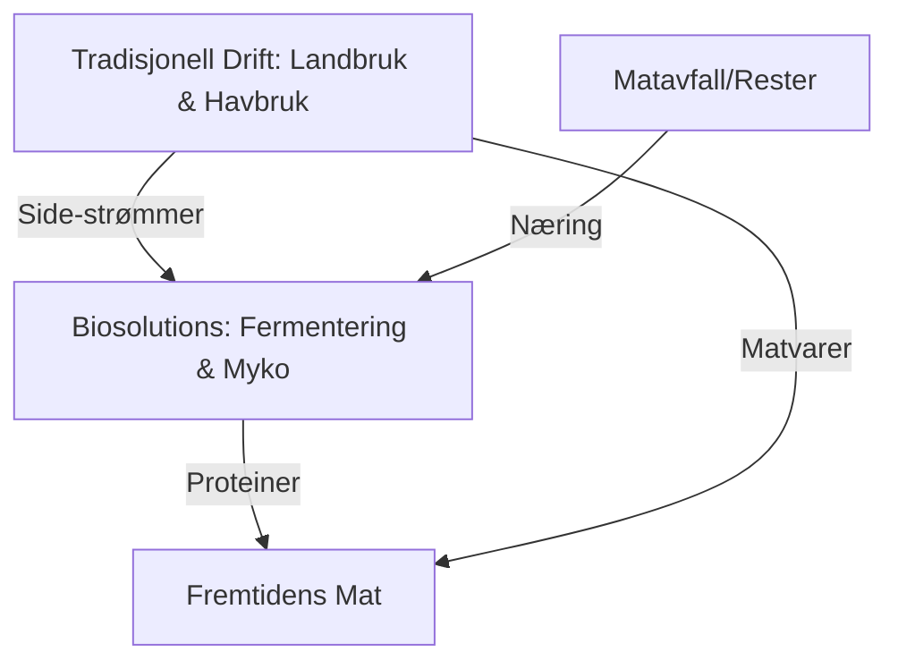

# SEC-MAT-TEK-01: Fremtidens Matteknologi i Norden
#sektor-mat #teknologi #fermentering #vertikal-dyrking #biotech #startups

## Oversikt
Den teknologiske modenheten i de nordiske landene gjør regionen til en testarena for fremtidens matproduksjon. Vi ser nå en bølge av "biosolutions" som utfordrer den tradisjonelle landbruksmodellen. Se [[SEC-MAT-TEK-02-Biotech-og-Fremtidens-Proteiner-Detalj|SEC-MAT-TEK-02]] for teknisk fordypning.

## Presisjonsfermentering (Precision Fermentation)
Bruk av mikroorganismer (gjær, bakterier, alger) for å "brygge" proteiner og fett som er identiske med animalske produkter:
*   **Melt & Marble (Sverige):** Skaper fett som smaker som biff og kylling, uten å involvere dyr.
*   **Unibio (Danmark):** Transformerer metangass til proteinrike pellets for fôr.
*   **Solar Foods (Finland):** Lager "Solein" -- et proteinmel laget av luft (CO2), vann og elektrisitet, med minimalt [[ENV-01-Klimaregnskap-GHG|klimaavtrykk]].

## Mykoprotein (Sopp-protein)
*   **Enifer (Finland):** Gjenbruker [[SEC-MAT-02-Sirkulaere-Prosesser-og-Biooekonomi|sidestrømmer]] fra skog- og matindustrien for å dyrke PEKILO-sopp, som er en næringsrik og bærekraftig proteinkilde for både mennesker og dyr.

## Vertikal Dyrking (Vertical Farming)
Kontrollert innendørs dyrking i flere lag med LED-belysning og vannresirkulering (Hydroponics):
*   **Status 2024:** Sektoren beveger seg fra R&D til storskalaproduksjon av urter, salat og bær, spesielt nær de store nordiske byene for å redusere transport.
*   **Energibruk:** Fokus på integrasjon med overskuddsvarme fra industri eller datasentre.

## Biosolutions-fyrtårn
Danmark har etablert et "Business Lighthouse for Biosolutions" for å bli verdensledende på bioteknologisk matproduksjon, og fungerer som en katalysator for hele Norden.

## Samspill mellom Tradisjon og Teknologi

## Kilder
*   [Enifer - PEKILO Protein](https://enifer.com)
*   [Solar Foods - Solein](https://solarfoods.com)
*   [Invest in Denmark - Biosolutions](https://investindk.com)

## Se også
- [[SEC-MAT-02-Sirkulaere-Prosesser-og-Biooekonomi|SEC-MAT-02: Sirkulære Prosesser og Bioøkonomi]]
- [[SEC-MAT-TEK-02-Biotech-og-Fremtidens-Proteiner-Detalj|SEC-MAT-TEK-02: Biotech og Fremtidens Proteiner – Detalj]]
- [[ENV-01-Klimaregnskap-GHG|ENV-01: Klimaregnskap og GHG]]
