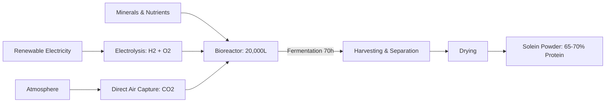
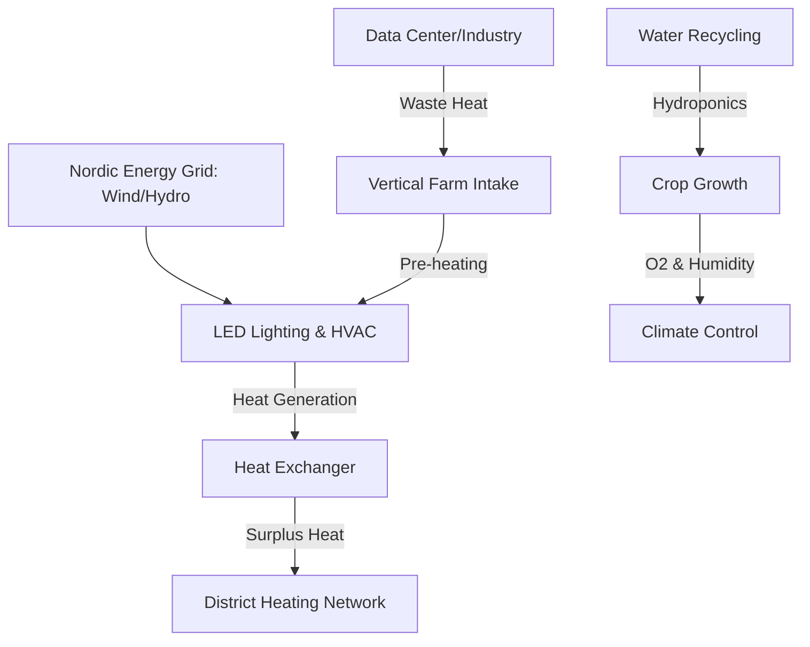

# SEC-MAT-TEK-02: Biotech og Fremtidens Proteiner – Teknisk Fordypning
#sektor-mat #biotech #fermentering #novel-food #fremtidens-proteiner #norden #efsa

> **Oversiktsdokument:** [[SEC-MAT-TEK-01-Fremtidens-Matteknologi|SEC-MAT-TEK-01: Fremtidens Matteknologi]]

Dette dokumentet gir en uttømmende teknisk kartlegging av nye matteknologier i en nordisk kontekst, verifisert mot EFSA-status og rapporter fra Nordisk Ministerråd for 2024/2025.

---

## 1. Presisjonsfermentering (Precision Fermentation)
Presisjonsfermentering i Norden ledes av Finland, med fokus på gassfermentering og oppskalering av mykoprotein.

### 1.1 Solar Foods – Solein (Gassfermentering)
**Teknisk status 2024/2025:**
*   **Factory 01:** Åpnet april 2024 i Vantaa, Finland. Verdens første kommersielle fabrikk for luft-protein.
*   **Kapasitet:** 160 tonn/år (mål om 230 tonn innen 2026).
*   **Bioreaktor:** 20 000 liter hovedtank. Produktivitet på 1 g/l/t oppnådd sent i 2024.
*   **Prosess:** Bruker hydrogen (fra egen elektrolyse) som energikilde og CO2 (via Direct Air Capture) som karbonkilde for mikroorganismer.

**Teknisk Prosessflyt (Solein):**

### 1.2 Enifer – PEKILO® (Mykoprotein)
**Teknisk status 2024/2025:**
*   **Kirkkonummi-anlegget:** Finansiering på €36M sikret mai 2024. Planlagt ferdigstillelse sent 2025.
*   **Kapasitet:** 3 000 tonn/år (tilsvarer protein fra 30 000 kuer).
*   **Råstoff:** Upcycling av sidestrømmer fra skog- og matindustri (laktosepermeat fra Valio, melasse, restprodukter fra tresliperier).
*   **Regulering:** Sendte første nordiske søknad om Novel Food-godkjenning til EFSA for menneskemat i oktober 2024.

---

## 2. Celle-basert Kjøtt (Cultivated Meat)
Status i EU preges av strengere retningslinjer, men den første formelle søknaden er nå inne.

### 2.1 EFSA Status 2024/2025
*   **Første søknad:** Mottatt september 2024 fra franske *Gourmey* (dyrket foie gras).
*   **Nye Retningslinjer:** EFSA publiserte oppdaterte krav i september 2024, gjeldende fra 1. februar 2025. Krever mer detaljert data om cellelinje-identitet, vekstmedier og genetisk stabilitet.
*   **Tidshorisont:** Estimert vurderingstid er 18–31 måneder. Godkjenning i EU forventes tidligst sent 2025/2026.
*   **Norden:** Pilotprosjekter (f.eks. Revo Foods i Østerrike/Norden-samarbeid) tester hybridprodukter (sopp + celler) for å omgå regulatoriske flaskehalser.

---

## 3. Novel Food Status: Insekter og Alger
EU har i 2024/2025 gjort betydelige endringer i Novel Food-katalogen for å akselerere det grønne skiftet.

### 3.1 Insekter
*   **Godkjente arter (status Q1 2025):** 7 insektingredienser er nå fullt godkjent.
*   **Siste autorisering:** UV-behandlet melbille-pulver (*Tenebrio molitor*) godkjent januar 2025 (Reg. 2025/89).
*   **Krav:** Obligatorisk merking av allergener (kryssreaktivitet med skalldyr og støvmidd).

### 3.2 Alger
*   **Reklassifisering 2024:** Over 20 arter (bl.a. Chlorella, Spirulina, Nori) er flyttet til "ikke-novel"-listen (krever ikke forhåndsgodkjenning).
*   **Andemat (Duckweed):** *Lemna minor* og *Lemna gibba* ble godkjent som Novel Food i januar 2025.

---

## 4. Vertikal Dyrking og Nordisk Energiintegrasjon
Integrasjon med det nordiske energinettet er nøkkelen til økonomisk bærekraft.

### 4.1 Teknisk integrasjon med fjernvarme
Nordisk Ministerråd (2024-rapporter) fremhever vertikal dyrking som en aktiv komponent i "Smart Energy Systems".

**Energisløyfe i et Nordisk Vertikalt Landbruk:**

**Tekniske nøkkeltall 2024:**
*   **Energiforbruk:** Redusert til ca. 10 kWh per kilo produsert mat i de mest effektive nordiske anleggene.
*   **Synergi:** Bruk av overskuddsvarme fra datasentre reduserer driftskostnader med opptil 30% i kalde regioner.
*   **Fleksibilitet:** Nordiske anlegg (f.eks. i Sverige og Finland) fungerer som "lastbalanserere" ved å skru ned LED-intensitet i perioder med høye strømpriser/nettbelastning.

---

## 5. Verifikasjonskilder (2024/2025)
*   **EFSA:** *Update of the Guidance on the preparation and submission of an application for authorisation of a novel food* (Sept 2024).
*   **Nordisk Ministerråd:** *Bioenergy Innovations Scoping Paper* (April 2024) og *Green Transition Initiative 2024-2028*.
*   **EU Regulation:** *Commission Implementing Regulation (EU) 2025/89* (Authorising UV-treated powder of Tenebrio molitor).
*   **Solar Foods / Enifer:** Tekniske årsrapporter og produksjonsdata for Factory 01 (Vantaa) og Kirkkonummi.

## Se også
- [[SEC-MAT-TEK-01-Fremtidens-Matteknologi|SEC-MAT-TEK-01: Fremtidens Matteknologi (Oversikt)]]
